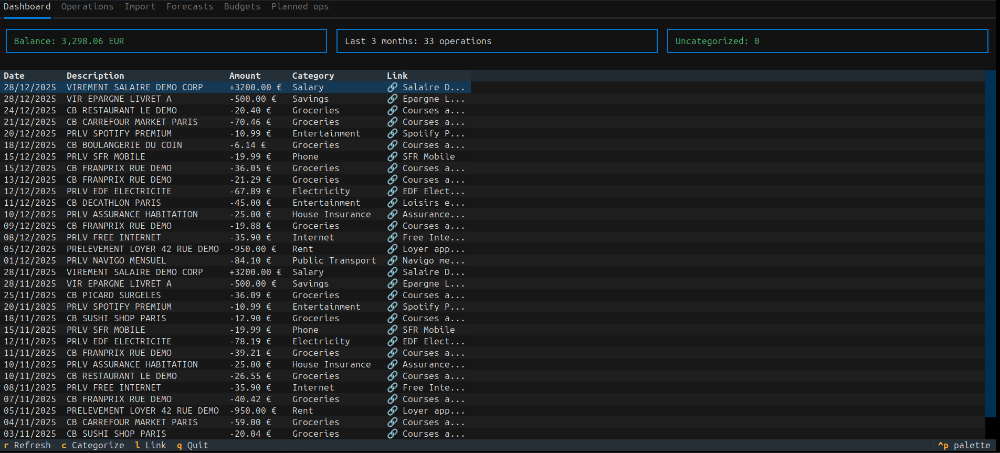
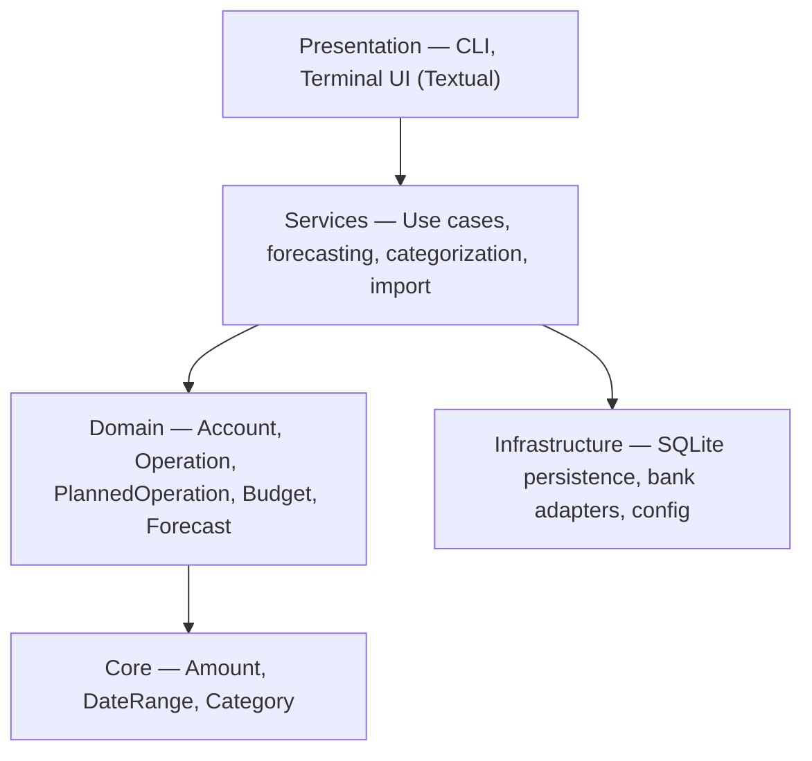

# Budget Forecaster

[](https://github.com/corentin-core/budget-forecaster/actions/workflows/ci.yml)
[](https://corentin-core.github.io/budget-forecaster/)


Personal budget forecasting CLI application. Import bank statements, categorize
transactions, and generate balance forecasts through a terminal UI.

## Why

I used to track my budget in a spreadsheet. The recurring question was always: **"Can I
afford this expense, and when?"**

The spreadsheet worked, but it was painful to maintain and nearly impossible to adjust
mid-month. I looked at existing tools — they had nice dashboards and direct bank
connections, but none could forecast my balance the way I needed, and their budget
management was too limited.

So I built my own.

## Features

- **Bank import** — Load statements from BNP Paribas (Excel) and Swile (JSON)
- **Categorization** — Automatic and manual categorization of transactions
- **Planned operations & budgets** — Define recurring expenses, one-time payments, and
  monthly budgets by category
- **Forecasting** — Project future balances based on planned operations, budgets, and
  history
- **Operation linking** — Match actual transactions to their planned counterparts for
  accurate forecast updates
- **Terminal UI** — Interactive interface built with
  [Textual](https://textual.textualize.io/)
- **Internationalization** — Available in English and French

## Screenshots

**Forecast** — Balance projection with budget breakdown by category:


**Operations** — Imported transactions with categories and links to planned operations:



## Quick Start

Demo data is included so you can try the application without your own bank statements.

```bash
# Clone and install
git clone https://github.com/corentin-core/budget-forecaster.git
cd budget-forecaster
python3.12 -m venv venv && source venv/bin/activate
pip install -e .

# Launch with the demo data
cd examples/
python -m budget_forecaster.main -c config.yaml
```

The demo database contains 3 months of categorized operations with planned counterparts
and budgets. See [examples/README.md](examples/README.md) for details.

## Architecture

The application follows a layered architecture with clear separation of concerns:



See [docs/dev/architecture.md](docs/dev/architecture.md) for the full layer diagram.

## Tech Stack

| Area          | Tools                                                |
| ------------- | ---------------------------------------------------- |
| Language      | Python 3.12                                          |
| UI            | [Textual](https://textual.textualize.io/)            |
| Persistence   | SQLite                                               |
| Testing       | pytest                                               |
| Type checking | mypy (strict mode)                                   |
| Linting       | pylint, ruff, autoflake, pyupgrade                   |
| Formatting    | black, prettier                                      |
| CI            | GitHub Actions (pre-commit, mypy, pylint, tests+cov) |
| Pre-commit    | All of the above, run locally before each commit     |

## Documentation

Browse the full documentation at
[corentin-core.github.io/budget-forecaster](https://corentin-core.github.io/budget-forecaster/):

- **User guides** — Configuration, forecast, operations, TUI usage
- **Developer docs** — Architecture, data models, persistence, contributing
- **Quality scenarios** — Given-When-Then specifications for core features

## Development

```bash
# Install with dev dependencies
pip install -e ".[dev]"

# Install pre-commit hooks
pip install pre-commit && pre-commit install

# Run tests
pytest tests/

# Run tests with coverage
pytest tests/ --cov=budget_forecaster --cov-report=html
```

See [docs/dev/contributing.md](docs/dev/contributing.md) for the full setup guide.
