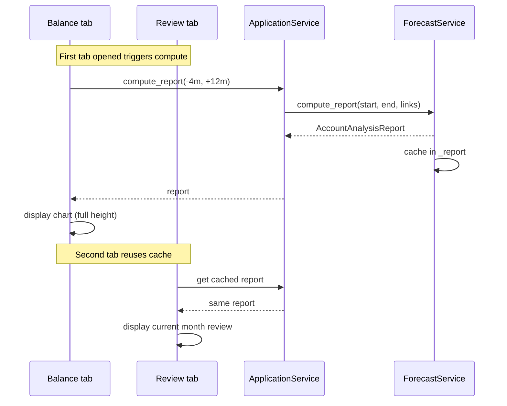
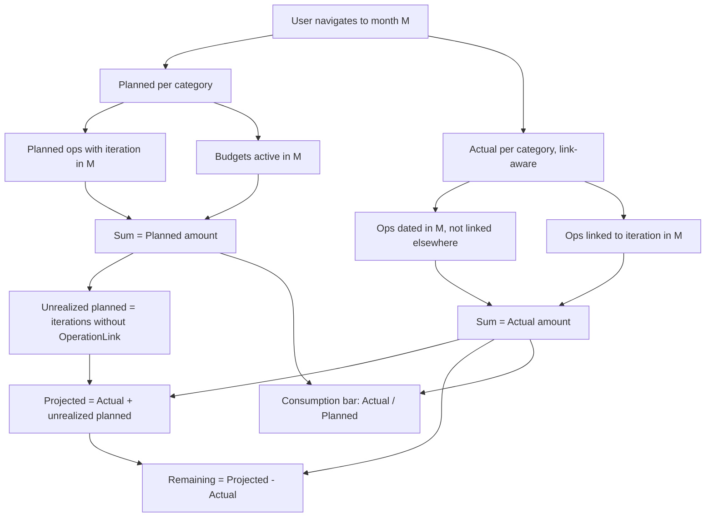
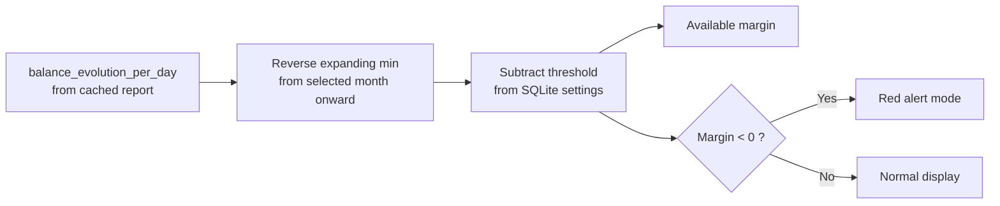
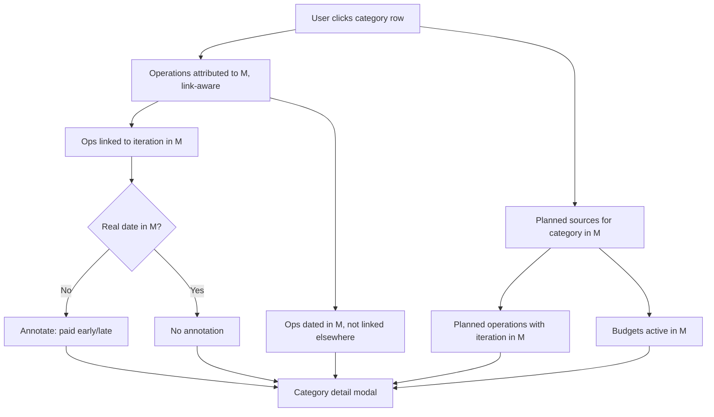

# Issue #142 — Monthly Review View & Available Margin Clarity

## Context

The current Forecast tab has a dense multi-month budget table (categories x months x
R/A/P) that's hard to read. Users need a simplified single-month view for their monthly
review workflow, plus a clearer explanation of the "available margin" concept.

## Decision Log

- **Categories as rows** (not columns) — avoids horizontal overflow, natural fit for
  progress bars
- **Reintroduce "Adjusted" as "Projected"** —
  `Projected = Actual + remaining planned not yet realized`. Shows the expected total
  for the month. `Remaining = Projected - Actual` (what's still to come). Overspend
  visible via Consumption bar (>100%, red) and Projected vs Planned columns.
- **Custom threshold** for available margin — stored in SQLite (new `settings` table),
  global (not per-account)
- **Category drill-down** — click a row to see planned sources + actual operations. Only
  available for categories with at least one attributed amount (Planned > 0 or Actual >
  0 in the summary table).
- **Cross-month links** (option C) — summary table uses link-aware attribution (accurate
  Remaining/progress). Detail modal uses the same attribution (no duplication across
  months).
- **Remove Calculate button** — auto-compute on tab open / month navigation, cache
  results
- **Keep Export Excel button** — useful for sharing with partner, opens a modal to
  choose the export period
- **Split into two tabs** — "Balance" (chart + export) and "Review" (monthly review +
  margin). Replaces the old "Forecasts" tab.
- **Unified computation** — replace `compute_budget_forecast` with an enriched version
  (link-aware, budget/planned distinction, Projected). Single source of truth used by
  both the Review tab and the Excel export. Fixes #248 in the process.
- **Split into 4 PRs** — reduce risk by implementing incrementally (see Implementation
  plan section)

## Design

### Tab structure

The old "Forecasts" tab is replaced by two separate tabs:

| Tab         | Purpose                                                          |
| ----------- | ---------------------------------------------------------------- |
| **Balance** | Macro view: balance evolution chart over time, Excel export      |
| **Review**  | Micro view: per-category planned vs actual for one month, margin |

Both tabs share the same cached `AccountAnalysisReport` (auto-computed on first access).
The report's `budget_forecast` DataFrame is the single source of truth — enriched with
link-aware attribution, budget/planned source distinction, and Projected column. Used by
the Review tab for the monthly table and by the Excel export.

### Balance tab mockup

```
┌──────────────────────────────────────────────────────────────────────────┐
│ Balance                                                      [Export]   │
├──────────────────────────────────────────────────────────────────────────┤
│                                                                          │
│ Balance evolution (Oct 2025 - Feb 2027)                                  │
│ ┌──────────────────────────────────────────────────────────────────────┐ │
│ │                                                                      │ │
│ │  4,000 € │ █ █                                                      │ │
│ │  3,000 € │ █ █ █ █ █                     █ █                        │ │
│ │  2,000 € │ █ █ █ █ █ █ █               █ █ █ █                     │ │
│ │  1,000 € │ █ █ █ █ █ █ █ █ █     █ █ █ █ █ █ █ █                  │ │
│ │      0 € │ █ █ █ █ █ █ █ █ █ █ █ █ █ █ █ █ █ █ █                  │ │
│ │          └──────────────────────────────────────────                 │ │
│ │           10/2025       04/2026       10/2026                        │ │
│ │                                                                      │ │
│ └──────────────────────────────────────────────────────────────────────┘ │
│                                                                          │
└──────────────────────────────────────────────────────────────────────────┘
```

The chart takes the full tab height, giving much better resolution than the current
cramped version. The `[Export]` button opens the export modal:

```
┌─────────────────────────────────────────────┐
│ Export forecast to Excel                    │
├─────────────────────────────────────────────┤
│                                             │
│ From  [2025-10-01      ]                    │
│ To    [2027-02-26      ]                    │
│                                             │
│                    [Cancel]  [Export]        │
└─────────────────────────────────────────────┘
```

Pre-filled with the cached report range (-4 to +12 months). If the user adjusts dates
beyond the cached range, the export recomputes the forecast for the wider range (with a
"Computing..." indicator).

### Review tab mockup

```
┌──────────────────────────────────────────────────────────────────────────┐
│ Review                                                                   │
├──────────────────────────────────────────────────────────────────────────┤
│                                                                          │
│                         ◀  February 2026  ▶                             │
│                                                                          │
│   Category       Planned  Actual  Projected  Remaining  Consumption     │
│ ── Forecasted ───────────────────────────────────────────────────────── │
│ ↓ Rent               800     800       800          0  [▓▓▓▓▓▓▓▓▓▓]100%│
│ ↓ Groceries          500     320       500       +180  [▓▓▓▓▓▓░░░░] 64%│
│ ↓ House works        300     180       300       +120  [▓▓▓▓▓▓░░░░] 60%│
│ ↓ Transport          100      45       100        +55  [▓▓▓▓░░░░░░] 45%│
│ ↓ Electricity         55      60        60          0  [▓▓▓▓▓▓▓▓▓▓!]109│
│ ↓ Internet            30      45        75        +30  [▓▓▓▓▓▓▓▓▓▓!]150│
│ ↓ Subscriptions       30      30        30          0  [▓▓▓▓▓▓▓▓▓▓]100%│
│ ↑ Salary           2 500   2 500     2 500          0  [▓▓▓▓▓▓▓▓▓▓]100%│
│ ↑ Freelance          500       0       500       +500  [░░░░░░░░░░]  0%│
│ ── Unforecasted ─────────────────────────────────────────────────────── │
│ ↓ Restaurants          -     120       120         --   120 EUR          │
│ ↓ Health               -      45        45         --    45 EUR          │
│ ─────────────────────────────────────────────────────────────────────── │
│   TOTAL            4 815   4 115     4 930       +815                   │
│                                                                          │
├──────────────────────────────────────────────────────────────────────────┤
│                                                                          │
│  Available margin: 1 250 EUR        Minimum threshold: 500 EUR [Edit]   │
│  ┌────────────────────────────────────────────────────────────────────┐  │
│  │ Balance at Feb 1st:    3 500 EUR                                  │  │
│  │ Lowest future balance: 1 250 EUR  (April 15, 2026)                │  │
│  │                                                                    │  │
│  │ = from this month onward, the most you can spend freely           │  │
│  │   without the account going below 500 EUR                         │  │
│  └────────────────────────────────────────────────────────────────────┘  │
│                                                                          │
│  --- When lowest future balance < threshold: -------------------------  │
│                                                                          │
│  Available margin: -200 EUR         Minimum threshold: 500 EUR [Edit]   │
│  ┌─── ALERT ─────────────────────────────────────────────────────────┐  │
│  │ Balance at Jun 1st:      800 EUR                                  │  │
│  │ Lowest future balance:   300 EUR  (August 3, 2026)                │  │
│  │                                                                    │  │
│  │ /!\ The account will go below your 500 EUR threshold              │  │
│  │     on August 3, 2026                                             │  │
│  └───────────────────────────────────────────────────────────────────┘  │
└──────────────────────────────────────────────────────────────────────────┘
```

### Behavior

**Auto-compute on open**: When either the Balance or Review tab becomes active, if no
report is cached, compute the forecast automatically. Default range: **-4 months to +12
months** from today. Both tabs share the same cached report. Show a "Computing..."
indicator while loading.

**Month navigation**: The `<` / `>` buttons navigate within the already-computed report
months. No re-computation needed — `get_monthly_summary()` already returns all months.
Current month is selected by default.

**Cache invalidation**: The cache is invalidated on any `refresh_data` call. This covers
all mutation scenarios: budget/planned operation edits, bank statement imports,
categorization changes, link creation/deletion.

### Display convention

All amounts in the table are displayed as **absolute values** (no minus signs). Expenses
and income are both shown as positive numbers. The underlying data uses negative values
for expenses — the absolute value conversion is purely presentational.

Each row has a **direction indicator**: `↓` for expenses, `↑` for income. This makes the
type explicit regardless of the row's position in the table.

The `Remaining` column uses signs: `+50` (under budget / saved), `-45` (over budget).
The `TOTAL` row uses signed arithmetic (income - expenses).

### Table sections

The table is divided into two labeled sections. Each row is **one category**,
aggregating all forecast sources (budgets + planned operations) for that category:

1. **Forecasted** — categories with at least one budget or planned operation for the
   month. Sorted by planned amount descending. Each row has `↑`/`↓` indicator, all
   columns (Planned/Actual/Projected/Remaining), and a progress bar. A category can
   combine both budget and planned operation sources (e.g., House works = 200€ budget +
   100€ planned plumber = 300€ Planned). The breakdown is visible in the detail modal.
2. **Unforecasted** — categories with actual operations but no budget or planned
   operation for the month. Shows `↑`/`↓` indicator, Actual amount only, no progress
   bar.

All forecasted rows (expenses and income) use the same progress bar format.

### Columns

| Column      | Formula                                             | Meaning                                    |
| ----------- | --------------------------------------------------- | ------------------------------------------ |
| Planned     | Sum of planned operations + budgets for the month   | What was expected                          |
| Actual      | Sum of realized operations (link-aware attribution) | What happened so far                       |
| Projected   | `Actual + remaining planned not yet realized`       | Expected total by end of month             |
| Remaining   | `Projected - Actual`                                | What's still expected to come              |
| Consumption | Bar: `Actual / Planned`                             | How much has been consumed/received so far |

#### Projected — precise definition

`Projected = Actual (link-aware) + remaining planned not yet realized`

This is conceptually the same as the existing "Adjusted" column in
`compute_budget_forecast`, which already uses `ForecastActualizer` + `AccountForecaster`
to combine real operations with unrealized planned amounts.

The work is to **extend** this existing computation, not reinvent it:

1. **Generalize to all months** — current code only computes "Adjusted" for the current
   month. Extend to compute Projected for every month in the report range.
2. **Link-aware attribution** — attribute operations to their linked iteration's month
   (not `operation_date`). Unlinked operations use their real date.
3. **Source distinction** — track whether each planned amount comes from a Budget or a
   PlannedOperation (currently lost via `itertools.chain`).

An iteration is **unrealized** if it has no `OperationLink` pointing to it.
Specifically:

- **Planned operations**: for each planned operation with an iteration in month M, check
  if an `OperationLink` exists with `target_type=PLANNED_OPERATION`, `target_id=op.id`,
  and `iteration_date` in M. If no link → the iteration's amount is "remaining planned".
- **Budgets**: for a budget active in month M with amount B, sum all linked operations
  (`target_type=BUDGET`, `target_id=budget.id`, `iteration_date` in M). The unrealized
  portion is `max(0, B - sum_of_linked_amounts)`. If linked amounts exceed B, the
  unrealized portion is 0 (the budget is fully consumed or exceeded).

**Past months** (before current month): all planned iterations should already be
realized or expired. In practice, `Projected ≈ Actual` for past months (the column is
redundant but consistent). No special-casing needed — the same formula applies.

**Key insight**: `Remaining = Projected - Actual` answers "what's still expected to
come". The overspend information is carried by `Consumption` (bar > 100%, red) and the
comparison of `Projected` vs `Planned` columns. Examples:

- Internet: Planned=30, Actual=45, Projected=75 → Remaining=**+30** (30€ still coming),
  Consumption=**150%** (red, overspent). Overspend visible via Projected (75) vs Planned
  (30).
- House works: Planned=300, Actual=180, Projected=300 → Remaining=**+120** (120€ still
  to spend), Consumption=**60%** (green, on track).
- Freelance: Planned=500, Actual=0, Projected=500 → Remaining=**+500** (still expected),
  Consumption=**0%** (nothing received yet).

### Consumption bars

- Fixed-width ASCII bar (10 chars), fill proportional to `Actual / Planned` ratio
- Shows how much has been consumed/received **so far** (not the projected end state)
- Same behavior for expenses and income (uniform across all forecasted rows)
- On track: **green** fill `[▓▓▓▓░░░░]`
- Over budget / exceeded: **red** fill + `!` marker `[▓▓▓▓▓▓▓▓!]`
- No forecast (unforecasted section): show actual amount only, no bar

### Remaining column

- Shows what's still expected to come (`Projected - Actual`)
- **Positive** (default color): unrealized planned amounts still pending
- **Zero**: everything has been realized
- `--` for categories without a planned amount

### Month navigation

- `<` / `>` buttons to navigate between months
- Keyboard: Left/Right arrows
- Data source: `ForecastService.get_monthly_summary()` (already provides `real` and
  `predicted` per category per month — all months available after one computation)

### Available margin section

**Definition**: the lowest projected balance **from the selected month onward**,
considering all future planned operations and budgets. The margin updates when
navigating between months.

Example:

- Viewing **February**: balance 3,500 EUR, lowest future point 1,250 EUR (April) →
  margin = 1,250 EUR
- Viewing **May** (after the April dip): balance 2,800 EUR, lowest future point 2,100
  EUR (August) → margin = 2,100 EUR

Already computed in the codebase via reverse expanding minimum on the balance evolution
(`_add_safe_margin`). We just need to read the value at the selected month's position.

**Past months**: the margin section is hidden for months before the current month. The
margin represents future spending capacity, which is not actionable for past months.

**Display** (current and future months only):

- Margin value prominently displayed
- Balance at the start of the selected month
- Exact date where the minimum occurs (day precision, from `balance_evolution_per_day`)
- Plain-language explanation (so the user's partner understands)

**Custom threshold**:

- `[Edit]` button to set a minimum balance floor (default: 0 EUR)
- Stored in SQLite `settings` table (see Threshold storage section)
- Explanation text adapts: "below **500 EUR**" if threshold is set
- Margin becomes: lowest future balance - threshold

**Alert when below threshold**:

- When the lowest future balance < threshold: section switches to alert mode
- Border and margin value in **red**
- Explicit warning message: "The account will go below your X EUR threshold on [date]"
- Margin value becomes negative (e.g., -200 EUR = 200 EUR short of the threshold)

### Cross-month linked operations

**Summary table** (Actual, Projected, Remaining, progress bars): uses **link-aware
attribution**. An operation linked to an iteration in another month is counted in the
iteration's month, not the operation's real date. Unlinked operations use their real
date. This ensures Remaining and progress bars are accurate.

Example — rent paid Feb 28th, linked to March 1st iteration:

- February summary: Rent Actual = 0 (attributed to March via link)
- March summary: Rent Actual = 800, Planned = 800, Remaining = 0, progress = 100%

**Detail modal**: uses the same link-aware attribution as the summary table. The modal
only shows categories that have at least one attributed amount (Planned > 0 or
attributed Actual > 0) for the selected month.

In the cross-month rent example:

- February: Rent row does **not** appear in the summary (Actual = 0, no planned) → no
  drill-down available
- March: Rent row appears (Actual = 800 attributed via link, Planned = 800) → drill-down
  shows the operation with an annotation about its real date

### Category detail modal (drill-down)

Clicking a category row opens a modal showing the breakdown of planned sources and
actual operations for that category in the selected month.

**Normal case** — all operations match their planned month:

```
┌──────────────────────────────────────────────────────────────────┐
│ Subscriptions — February 2026                                    │
├──────────────────────────────────────────────────────────────────┤
│                                                                  │
│ Planned sources                                                  │
│ ──────────────────────────────────────────────────── ─────────── │
│ [planned] Netflix          monthly, 1st                  -15.00  │
│ [planned] Spotify          monthly, 15th                 -10.00  │
│ [planned] Gym membership   monthly, 5th                  -30.00  │
│ ──────────────────────────────────────────────────── ─────────── │
│ Total planned                                            -55.00  │
│                                                                  │
│ Operations                                                       │
│ ──────────────────────────────────────────────────── ─────────── │
│ 02/01  NETFLIX.COM                                       -15.00  │
│ 02/05  BASIC FIT PRELEVEMENT                             -30.00  │
│ 02/15  SPOTIFY AB                                        -10.00  │
│ ──────────────────────────────────────────────────── ─────────── │
│ Total actual                                             -55.00  │
│                                                                  │
│ Actual: 55 / Projected: 55 / Planned: 55    Remaining: 0 EUR    │
│                                                       [Close]    │
└──────────────────────────────────────────────────────────────────┘
```

**Mixed sources case** — category with both budget and planned operation:

```
┌──────────────────────────────────────────────────────────────────┐
│ House works — February 2026                                      │
├──────────────────────────────────────────────────────────────────┤
│                                                                  │
│ Planned sources                                                  │
│ ──────────────────────────────────────────────────── ─────────── │
│ [budget]  House works        200€/month                 -200.00  │
│ [planned] Plumber visit      one-time, 15th             -100.00  │
│ ──────────────────────────────────────────────────── ─────────── │
│ Total planned                                           -300.00  │
│                                                                  │
│ Operations                                                       │
│ ──────────────────────────────────────────────────── ─────────── │
│ 02/03  LEROY MERLIN                                      -80.00  │
│ 02/15  PLOMBIER DUPONT                                  -100.00  │
│ ──────────────────────────────────────────────────── ─────────── │
│ Total actual                                            -180.00  │
│                                                                  │
│ Actual: 180 / Projected: 300 / Planned: 300  Remaining: 120 EUR │
│                                                       [Close]    │
└──────────────────────────────────────────────────────────────────┘
```

The `[budget]` and `[planned]` tags distinguish the source type. This is where the user
sees the breakdown that is aggregated in the summary table.

**Cross-month case** — rent paid on Feb 28th, linked to March iteration:

The operation is attributed to March (link-aware). February has no Rent row. March
detail shows the operation with an annotation about its real payment date:

```
┌──────────────────────────────────────────────────────────────────┐
│ Rent — March 2026                                                │
├──────────────────────────────────────────────────────────────────┤
│                                                                  │
│ Planned sources                                                  │
│ ──────────────────────────────────────────────────── ─────────── │
│ [planned] Rent           monthly, 1st                   -800.00  │
│                                                                  │
│ Operations                                                       │
│ ──────────────────────────────────────────────────── ─────────── │
│ 02/28  VIREMENT LOYER                                   -800.00  │
│         ← paid early (operation dated Feb 28)                    │
│ ──────────────────────────────────────────────────── ─────────── │
│ Total actual                                            -800.00  │
│                                                                  │
│ Actual: 800 / Projected: 800 / Planned: 800  Remaining: 0 EUR   │
│                                                       [Close]    │
└──────────────────────────────────────────────────────────────────┘
```

**Planned sources section**: Lists each source with a `[budget]` or `[planned]` tag, its
periodicity, and amount for that month. This is the only place where the distinction
between budget and planned operation sources is visible (the summary table aggregates
them).

**Operations section**: Shows operations attributed to this month (link-aware):

- Operations with `operation_date` in month M and not linked to another month
- Operations linked to an iteration in month M (regardless of real date)

Cross-month operations are annotated with their real date:
`← paid early/late (operation dated [date])`

**Unlinked operations**: Operations not linked to any planned source appear normally in
the Operations section. No annotation needed — the absence of a matching Planned entry
is self-explanatory.

**Footer**: Summary line with actual, projected, planned totals and remaining.

### Empty states

| Scenario                        | Behavior                                                                         |
| ------------------------------- | -------------------------------------------------------------------------------- |
| First tab open, no report yet   | "Computing..." spinner, auto-compute triggers                                    |
| Month with no data (far future) | Empty table with "No planned operations or budgets for this month"               |
| No links exist at all           | Projected = Actual for all categories (formula works correctly, no special case) |
| No budgets/planned ops defined  | Only the "no budget" section appears, with actual operations                     |

### Interactions

| Key     | Action                     |
| ------- | -------------------------- |
| `Left`  | Previous month             |
| `Right` | Next month                 |
| `Enter` | Open category detail modal |
| `e`     | Edit margin threshold      |

## Threshold storage

New `settings` key-value table in SQLite. Global (not per-account).

**Schema migration V5 → V6**:

```sql
CREATE TABLE IF NOT EXISTS settings (
    key TEXT PRIMARY KEY,
    value TEXT NOT NULL
);
INSERT INTO settings (key, value) VALUES ('margin_threshold', '0');
```

`CURRENT_SCHEMA_VERSION` goes from 5 to 6 in `sqlite_repository.py`.

Access via new repository methods:

- `get_setting(key: str) -> str | None`
- `set_setting(key: str, value: str) -> None`

Threshold value stored as string, parsed as `Decimal` by the service layer.

## Data flow

### Tab open — auto-compute (shared cache)



### Month navigation — summary table (link-aware)



### Available margin (updates on navigation)



### Category detail modal (drill-down)



## Files affected

| File                                              | Change                                                                                                                                     |
| ------------------------------------------------- | ------------------------------------------------------------------------------------------------------------------------------------------ |
| `tui/app.py`                                      | Replace Forecasts TabPane with Balance + Review TabPanes, wire up shared cache                                                             |
| `tui/screens/forecast.py`                         | Rename to Balance tab: keep chart (full height), remove budget table, remove date inputs + Calculate btn, auto-compute                     |
| `tui/screens/review.py`                           | New Review tab: month navigation, monthly review table, margin section                                                                     |
| `tui/modals/export_forecast.py`                   | New modal for Excel export with date range inputs                                                                                          |
| `tui/modals/category_detail.py`                   | New modal for category drill-down (planned sources + operations)                                                                           |
| `infrastructure/persistence/sqlite_repository.py` | New `settings` table (V6 migration), `get_setting`/`set_setting` methods                                                                   |
| `services/account/account_analyzer.py`            | Replace `compute_budget_forecast` with enriched version: link-aware attribution, budget/planned distinction, Projected column (fixes #248) |
| `services/account/account_analysis_renderer.py`   | Adapt Excel export to use the enriched `budget_forecast` DataFrame                                                                         |
| `services/forecast/forecast_service.py`           | Adapt `get_monthly_summary` to read enriched data + add available margin computation                                                       |
| `services/application_service.py`                 | Expose new methods (margin, settings)                                                                                                      |
| `tests/`                                          | Tests for: link-aware attribution, Projected computation, margin, settings persistence, empty states                                       |

## Implementation plan

Split into 4 PRs to reduce risk:

| PR                                               | Scope                                                                                                                                                                                                                                                                                                | Dependencies |
| ------------------------------------------------ | ---------------------------------------------------------------------------------------------------------------------------------------------------------------------------------------------------------------------------------------------------------------------------------------------------- | ------------ |
| **PR1**: Tab split + auto-compute + export modal | Structural TUI change. Replace Forecasts tab with Balance + Review shells. Auto-compute on open, cache sharing. Export modal. No new business logic.                                                                                                                                                 | None         |
| **PR2**: Monthly review table + Projected        | Core business logic. Replace `compute_budget_forecast` with enriched version (link-aware, budget/planned distinction, Projected). Adapt `get_monthly_summary` and Excel export. Review tab displays the monthly table with Planned/Actual/Projected/Remaining columns and progress bars. Fixes #248. | PR1          |
| **PR3**: Category detail modal                   | Drill-down modal with planned sources and attributed operations. Cross-month annotations.                                                                                                                                                                                                            | PR2          |
| **PR4**: Available margin + threshold            | Margin section in Review tab. SQLite `settings` table (V6 migration). Threshold edit. Alert mode. Past-month hiding.                                                                                                                                                                                 | PR2          |

PR3 and PR4 are independent of each other and can be developed in parallel after PR2.

All PRs target a **feature branch** (`feature/142-monthly-review`), not `main` directly.
A final merge PR brings the complete feature into `main` once all PRs are merged into
the feature branch.

| PR                            | Scope                                                                                                                                                                                                                                                                                  | Dependencies |
| ----------------------------- | -------------------------------------------------------------------------------------------------------------------------------------------------------------------------------------------------------------------------------------------------------------------------------------- | ------------ |
| **PR5**: Documentation + demo | Update user docs, dev docs, and quality docs to reflect the new tabs (Balance/Review), columns (Projected, Consumption), and margin feature. Check if demo data covers the new features (link-aware attribution, mixed budget+planned categories, margin threshold), update if needed. | PR1-PR4      |

## i18n — New translations per PR

Each PR must add the required French translations to `messages.po` / `.mo`.

### PR1 — Balance tab + Export modal

| msgid                                        | msgstr (fr)                                                |
| -------------------------------------------- | ---------------------------------------------------------- |
| `Export`                                     | `Exporter`                                                 |
| `Computing...`                               | `Calcul en cours...`                                       |
| `Report: {} to {}`                           | `Rapport : {} à {}`                                        |
| `Monthly review — coming in a future update` | `Revue mensuelle — disponible dans une mise à jour future` |
| `Export forecast to Excel`                   | `Exporter la prévision en Excel`                           |
| `To`                                         | `Au`                                                       |
| `Exporting...`                               | `Export en cours...`                                       |

### PR2 — Review table

Strings to anticipate (finalize during implementation):

- Month navigation labels, section headers (Forecasted / Unforecasted)
- Column headers (Planned, Actual, Projected, Remaining, Consumption)
- Empty state messages

### PR3 — Detail modal

- Modal title, section headers (Planned sources / Operations)
- Cross-month annotations (`paid early`, `paid late`)
- Tags: `[budget]`, `[planned]`

### PR4 — Margin + threshold

- Margin section labels, alert messages
- Threshold edit modal labels

## Out of scope

- Excel export improvements beyond adapting to the new DataFrame (separate issue)
- Historical pie chart
