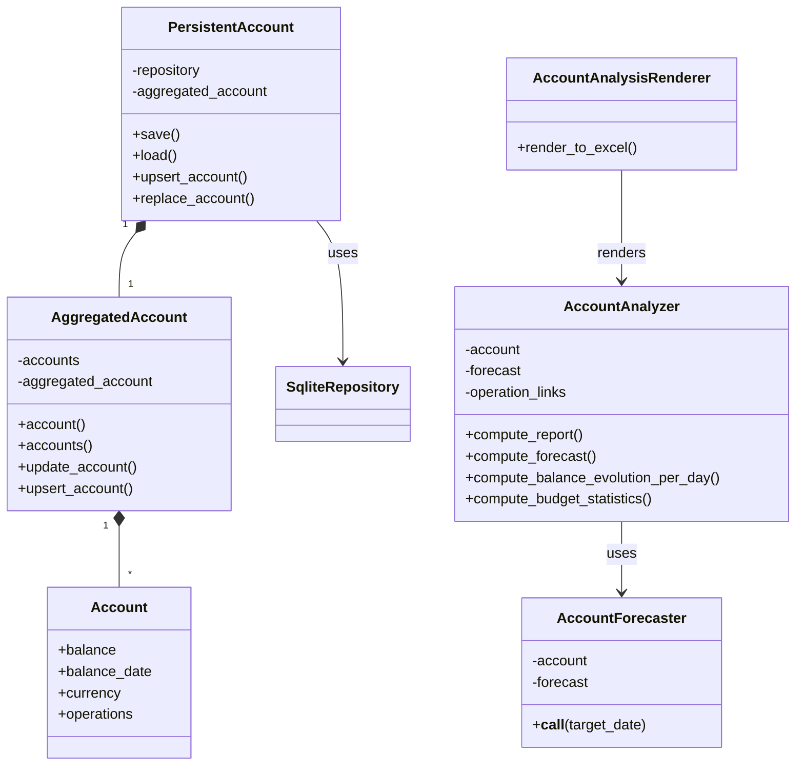
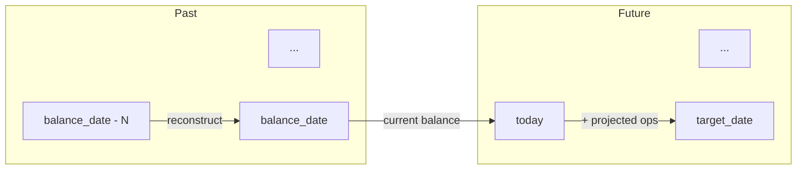
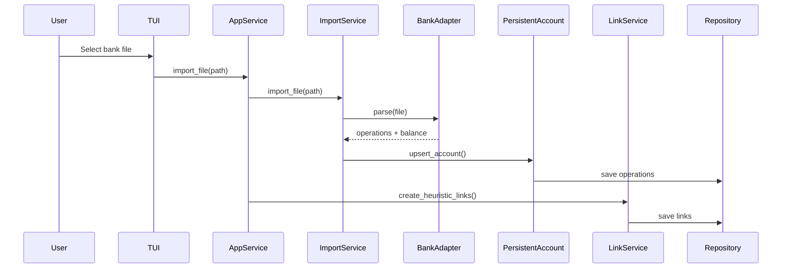

# Account Management

This document describes account management, balance projection, and the bank import
process.

## Components

PersistentAccount is the entry point for account management, handling persistence and
duplicate detection on import. AggregatedAccount combines multiple bank accounts (e.g.,
checking + savings) into a unified view. AccountForecaster projects balance at any date
by combining historic operations with forecast data.

## Balance Projection

AccountForecaster computes account state at any target date:

- **Past dates**: Subtract operations between target and balance_date from current
  balance
- **Future dates**: Add projected operations from actualized forecast to current balance

Projected operations are generated daily from planned operations and budgets,
distributing amounts evenly across their time ranges.

## Bank Import Flow

BankAdapter auto-detects the file format (BNP Excel or Swile JSON). Operations are
deduplicated against existing data before saving.
