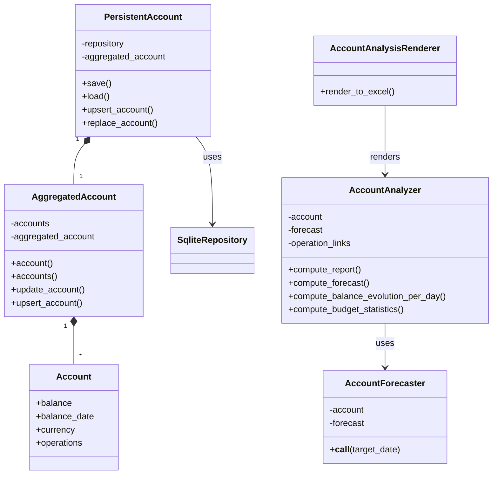
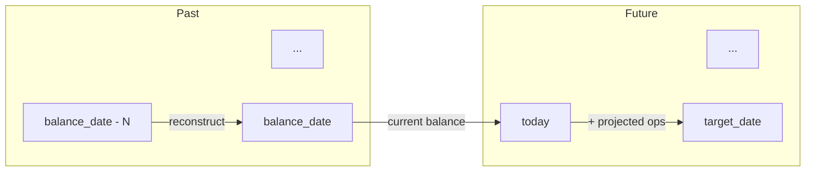
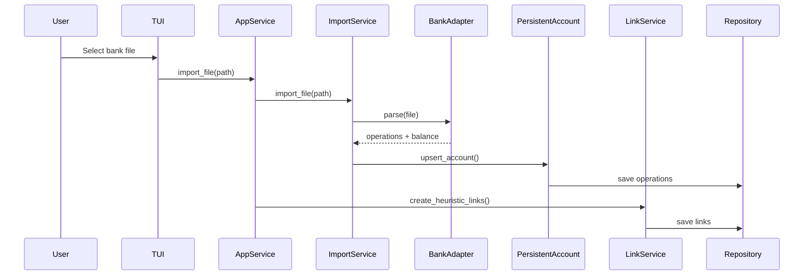

# Account Management

This document describes account management, balance projection, and the bank import
process.

## Components

| Component                   | Responsibilities                                                               |
| --------------------------- | ------------------------------------------------------------------------------ |
| **PersistentAccount**       | Facade for multi-account management. Loads/saves accounts, detects duplicates. |
| **AggregatedAccount**       | Combines multiple bank accounts into a single view.                            |
| **Account**                 | Single bank account with balance, date, and operations.                        |
| **AccountForecaster**       | Computes account state at any date (past or future).                           |
| **AccountAnalyzer**         | Generates analysis reports with statistics.                                    |
| **AccountAnalysisRenderer** | Excel export with charts.                                                      |

## Balance Projection

AccountForecaster computes account state at any target date:

- **Past dates**: Subtract operations between target and balance_date from current
  balance
- **Future dates**: Add projected operations from actualized forecast to current balance

Projected operations are generated daily from planned operations and budgets,
distributing amounts evenly across their time ranges.

## Bank Import Flow

The import process:

1. User selects a bank export file (BNP Excel or Swile JSON)
2. BankAdapter auto-detects format and parses the file
3. Operations are deduplicated against existing data
4. New operations are saved to the repository
5. Heuristic links are created for categorized operations
