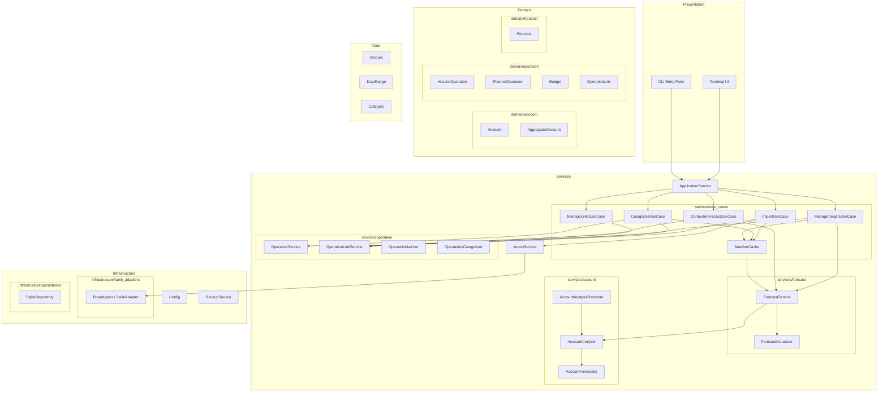

# Architecture Overview

This document describes the high-level architecture of Budget Forecaster.

## Layer Criteria

| Layer              | Purpose             | Contains                                                                          |
| ------------------ | ------------------- | --------------------------------------------------------------------------------- |
| **Core**           | Foundational types  | Primitives with no dependencies: `Amount`, `DateRange`, `Category`                |
| **Domain**         | Business entities   | Pure data objects and business rules. No orchestration, no external dependencies  |
| **Services**       | Orchestration       | Coordination between domain objects, use case implementation, computed aggregates |
| **Infrastructure** | External interfaces | Persistence, file parsing, configuration, rendering                               |
| **Presentation**   | User interfaces     | CLI, TUI. Delegates to Services                                                   |

**Key distinction**: Domain objects represent _what_ exists in the business model.
Services implement _how_ to coordinate those objects for specific use cases.

## Layer Diagram

Budget Forecaster is a personal finance application that imports bank statements,
categorizes transactions, and generates balance forecasts.

The **Presentation** layer provides user interfaces: a Terminal UI for interactive use
and a CLI for scripted operations. Both delegate to **Services**, which orchestrate
business logic.

The **Services** layer coordinates domain objects and implements use cases.
`ApplicationService` is a thin facade that delegates orchestration to focused use cases:

- `ImportUseCase`: Import bank files and create heuristic links
- `CategorizeUseCase`: Categorize operations and manage heuristic links on category
  change
- `ManageTargetsUseCase`: CRUD and split for planned operations and budgets
- `ManageLinksUseCase`: Manual link creation
- `ComputeForecastUseCase`: Forecast report computation
- `MatcherCache`: Shared lazy-loaded cache of operation matchers

Lower-level services handle specific concerns:

- `ForecastService`: CRUD for planned operations/budgets, report computation
- `AccountForecaster`/`AccountAnalyzer`: Compute account projections and aggregates
- `AccountAnalysisRenderer`: Export analysis reports to Excel
- `OperationService`/`OperationLinkService`: Manage operations and links
- `OperationMatcher`/`OperationsCategorizer`: Match and categorize operations
- `ForecastActualizer`: Adjust forecasts based on linked operations

The **Domain** layer holds pure business entities: accounts, operations, planned
operations, budgets, forecasts, and operation links. These are data objects with
business rules but no orchestration logic.

The **Core** layer provides foundational types (Amount, DateRange, Category) with no
external dependencies.

The **Infrastructure** layer handles external concerns: SQLite persistence, bank file
parsing (BNP, Swile), configuration, and rendering.

## Documentation Index

- [Operations & Linking](operations.md) - Operation hierarchy, linking system,
  categorization
- [Forecast](forecast.md) - Forecast structure, actualization algorithm
- [Account](account.md) - Account management, balance projection, bank import
- [Persistence](persistence.md) - Repository interfaces, service layer
- [Configuration](configuration.md) - YAML config, logging, backup settings
