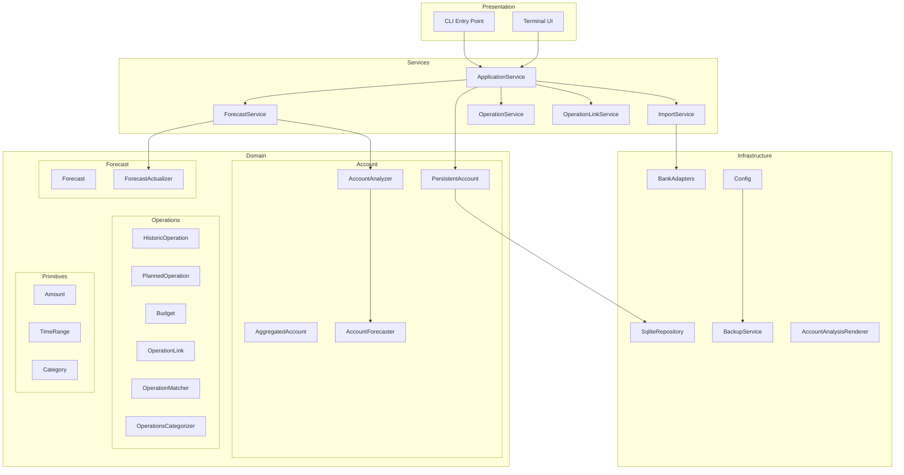
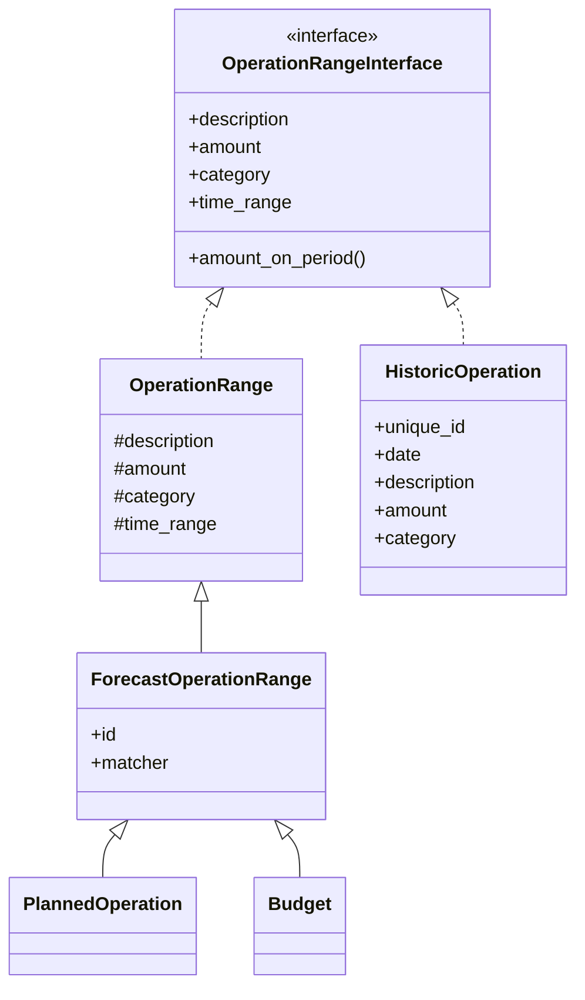
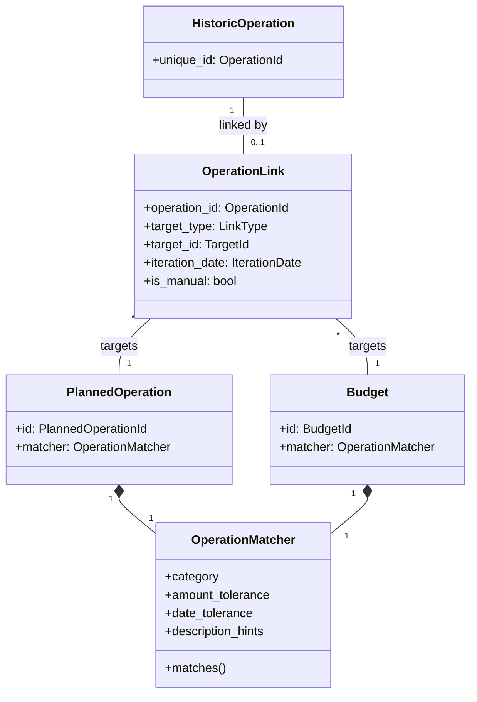
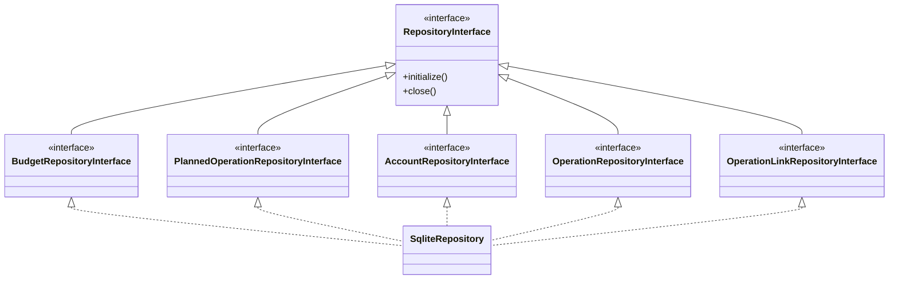
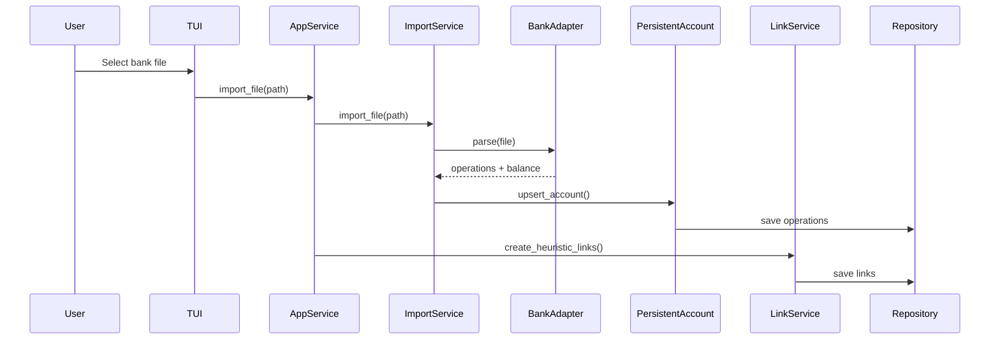
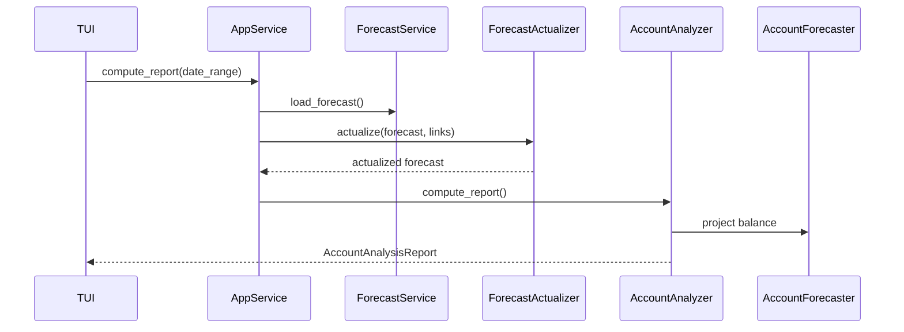
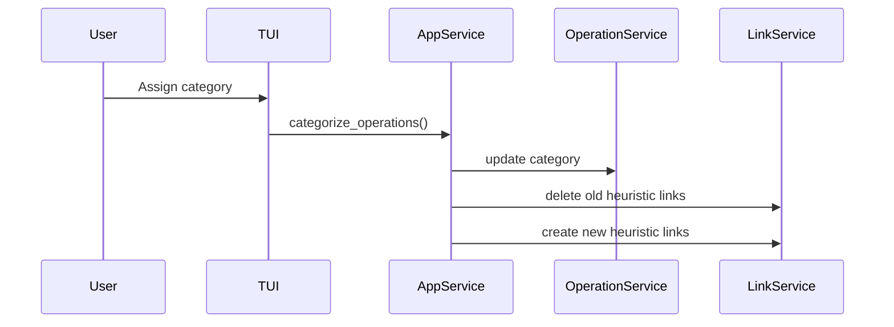

# Architecture Overview

This document describes the high-level architecture of Budget Forecaster.

## Layer Diagram

## Module Responsibilities

### Services Layer

Orchestrates business logic and coordinates between domain objects.

| Component                | Responsibilities                                                                                         |
| ------------------------ | -------------------------------------------------------------------------------------------------------- |
| **ApplicationService**   | Central facade for TUI. Manages matcher cache, coordinates imports, categorization, and CRUD operations. |
| **ForecastService**      | Loads forecast data, computes reports, provides statistics (monthly summaries, category totals).         |
| **ImportService**        | Handles bank file imports. Manages inbox folder, deduplicates operations.                                |
| **OperationService**     | CRUD for historic operations. Filtering, category suggestions, aggregations.                             |
| **OperationLinkService** | Implements heuristic linking algorithm with scoring. Bridges matchers and repository.                    |

### Domain Layer

#### Account Management

| Component             | Responsibilities                                                                           |
| --------------------- | ------------------------------------------------------------------------------------------ |
| **PersistentAccount** | Facade for multi-account management. Loads/saves accounts, detects duplicates.             |
| **AggregatedAccount** | Combines multiple bank accounts into a single view.                                        |
| **AccountForecaster** | Computes account state at any date (past reconstruction or future projection).             |
| **AccountAnalyzer**   | Generates analysis reports with balance evolution, budget statistics, category breakdowns. |

#### Operations

| Component                 | Responsibilities                                                                                       |
| ------------------------- | ------------------------------------------------------------------------------------------------------ |
| **HistoricOperation**     | Immutable record of a completed bank transaction.                                                      |
| **PlannedOperation**      | Expected recurring or one-time operation with matcher.                                                 |
| **Budget**                | Allocated amount for a category over a time period.                                                    |
| **OperationLink**         | Associates a historic operation to a planned operation or budget iteration.                            |
| **OperationMatcher**      | Scoring rules for matching operations (category, amount tolerance, date proximity, description hints). |
| **OperationsCategorizer** | Auto-categorizes operations based on forecast matchers.                                                |

#### Forecast

| Component              | Responsibilities                                                                             |
| ---------------------- | -------------------------------------------------------------------------------------------- |
| **Forecast**           | Immutable container (NamedTuple) for planned operations and budgets.                         |
| **ForecastActualizer** | Updates forecast based on links. Handles late iterations, postponements, budget consumption. |

#### Primitives

| Component     | Responsibilities                                    |
| ------------- | --------------------------------------------------- |
| **Amount**    | Immutable money value with currency.                |
| **TimeRange** | Time period abstractions (single, daily, periodic). |
| **Category**  | Enum of transaction categories.                     |

### Infrastructure Layer

| Component                   | Responsibilities                                                             |
| --------------------------- | ---------------------------------------------------------------------------- |
| **SqliteRepository**        | Persistence for all domain objects. Implements ISP-compliant interfaces.     |
| **BankAdapters**            | Parse bank export files (BNP Excel, Swile JSON). Auto-detection via factory. |
| **Config**                  | YAML configuration loading and logging setup.                                |
| **BackupService**           | Automatic database backups with rotation.                                    |
| **AccountAnalysisRenderer** | Excel export with charts (balance evolution, expense breakdown).             |

## Class Relationships

### Operation Hierarchy

### Linking System

### Repository Interfaces (ISP)

## Data Flows

### Bank Import Flow

### Forecast Computation Flow

### Categorization Flow

## Key Algorithms

### Heuristic Link Matching

When an operation is imported or categorized, the system attempts to link it to a
planned operation or budget:

1. **Filter candidates** by category match
2. **Score each candidate** based on:
   - Amount proximity (within tolerance ratio)
   - Date proximity (within tolerance days)
   - Description hint matches (substring matching)
3. **Select best match** if score exceeds threshold
4. **Determine iteration date** from the planned operation's time range

Manual links (user-created) are never overwritten by heuristic matching.

### Forecast Actualization

The ForecastActualizer adjusts planned operations based on actual data:

1. **Identify actualized iterations** - iterations with links to past operations
2. **Detect late iterations** - past iterations without links (within tolerance window)
3. **Postpone late iterations** - create one-time operations for tomorrow
4. **Advance periodic operations** - move start date past last actualized iteration
5. **Consume budgets** - reduce remaining amount based on linked operations

### Balance Projection

AccountForecaster computes account state at any target date:

- **Past dates**: Subtract operations between target and balance_date from current
  balance
- **Future dates**: Add projected operations from actualized forecast to current balance

Projected operations are generated daily from planned operations and budgets,
distributing amounts evenly across their time ranges.

## Configuration

The application uses YAML configuration with:

- **Database path**: SQLite file location
- **Inbox path**: Folder for bank exports (auto-import)
- **Backup settings**: Enable/disable, max backups, rotation
- **Logging**: Python dictConfig format for flexible logging setup

Default configuration is created on first run at
`~/.config/budget-forecaster/config.yaml`.
