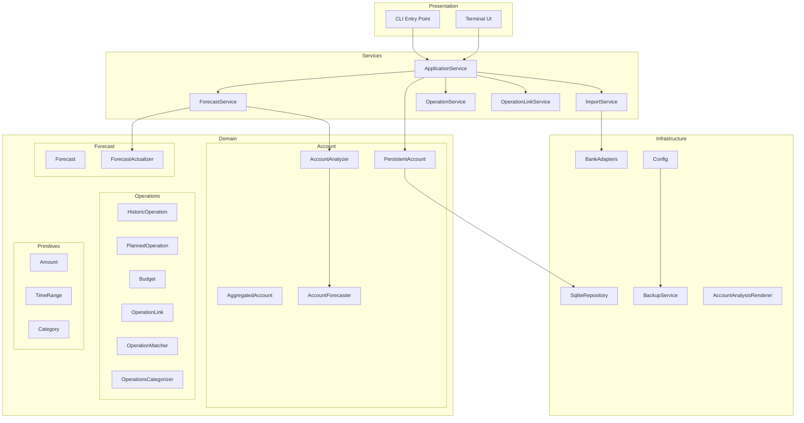

# Architecture Overview

This document describes the high-level architecture of Budget Forecaster.

## Layer Diagram

Budget Forecaster is a personal finance application that imports bank statements,
categorizes transactions, and generates balance forecasts.

The **Presentation** layer provides user interfaces: a Terminal UI for interactive use
and a CLI for scripted operations. Both delegate to **Services**, which orchestrate
business logic without containing domain knowledge.

The **Domain** layer holds the core model: accounts with their operations, planned
operations and budgets for forecasting, and the linking system that connects actual
transactions to their planned counterparts. Primitives (Amount, TimeRange, Category)
provide the foundational types.

The **Infrastructure** layer handles external concerns: SQLite persistence, bank file
parsing (BNP, Swile), configuration, and exports.

## Key Invariants

- An operation can be linked to at most one planned operation or budget iteration
- Manual links are never overwritten by heuristic matching
- Balance projection is deterministic given the same inputs

## Configuration

The application uses YAML configuration with:

- **Database path**: SQLite file location
- **Inbox path**: Folder for bank exports (auto-import)
- **Backup settings**: Enable/disable, max backups, rotation
- **Logging**: Python dictConfig format for flexible logging setup

Default configuration is created on first run at
`~/.config/budget-forecaster/config.yaml`.

## Documentation Index

- [Operations & Linking](operations.md) - Operation hierarchy, linking system,
  categorization
- [Forecast](forecast.md) - Forecast structure, actualization algorithm
- [Account](account.md) - Account management, balance projection, bank import
- [Persistence](persistence.md) - Repository interfaces, service layer
