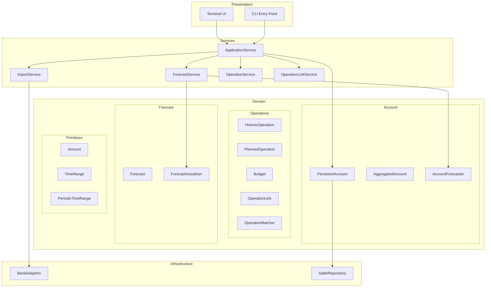
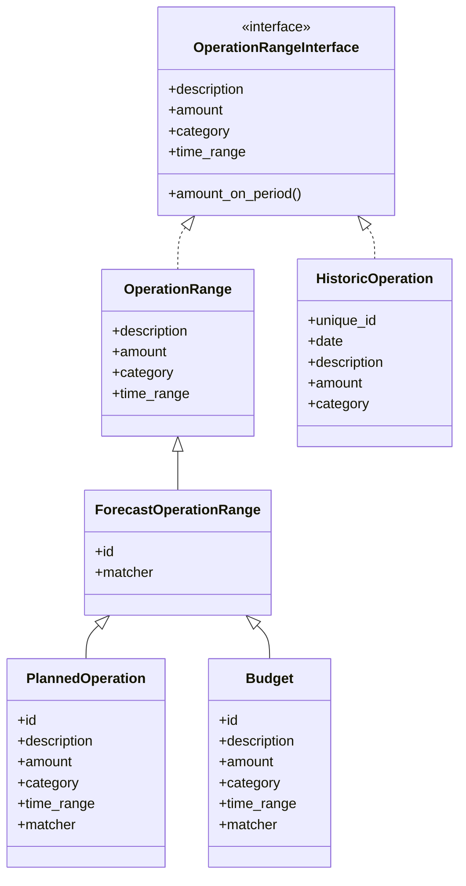
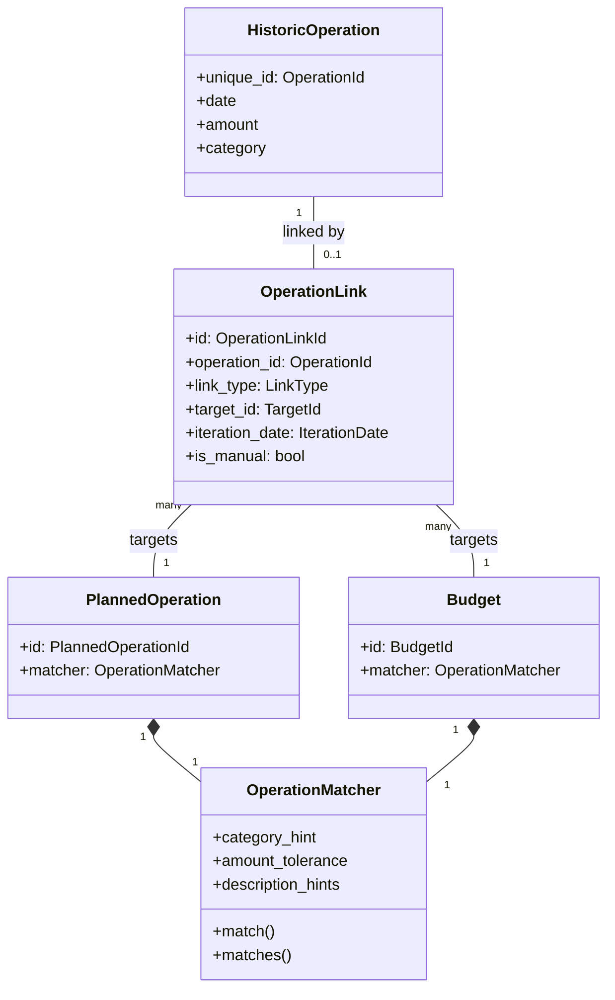
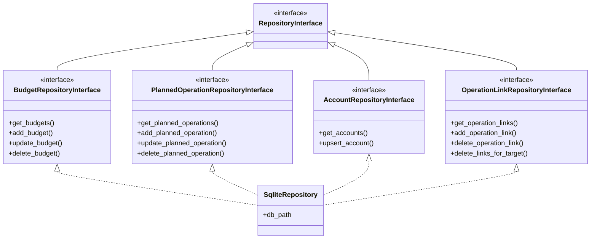
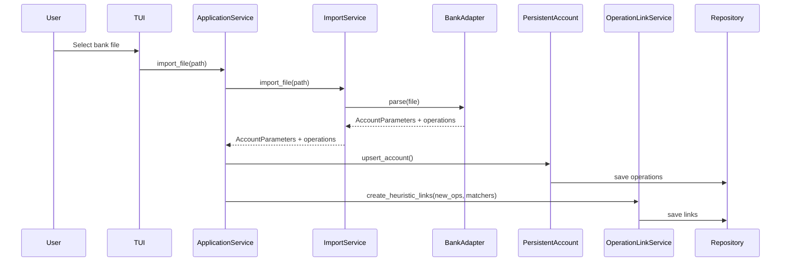
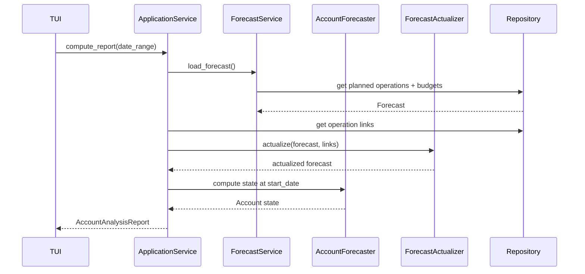
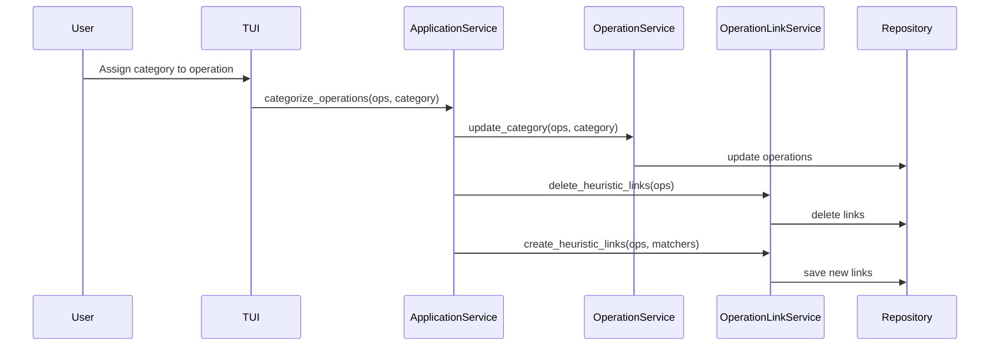

# Architecture Overview

This document describes the high-level architecture of Budget Forecaster.

## Layer Diagram

## Module Responsibilities

### Services Layer

Orchestrates business logic and coordinates between domain objects.

| Component                | Responsibilities                                                                                                                                 |
| ------------------------ | ------------------------------------------------------------------------------------------------------------------------------------------------ |
| **ApplicationService**   | Central orchestrator for TUI. Manages matcher cache, coordinates imports, categorization, and CRUD operations on planned operations and budgets. |
| **ForecastService**      | Loads forecast data, computes account analysis reports, provides aggregated statistics (monthly summaries, category totals).                     |
| **ImportService**        | Handles bank file imports via adapters. Manages inbox folder, deduplicates operations, calculates balance from exports.                          |
| **OperationService**     | CRUD for historic operations. Filtering, category suggestions, and aggregations.                                                                 |
| **OperationLinkService** | Bridges matchers and repository. Implements heuristic linking algorithm with scoring.                                                            |

### Domain Layer

#### Account Management

| Component             | Responsibilities                                                                                           |
| --------------------- | ---------------------------------------------------------------------------------------------------------- |
| **PersistentAccount** | Facade for multi-account management. Loads/saves accounts, merges imported operations, detects duplicates. |
| **AggregatedAccount** | Combines multiple accounts into a single view. Aggregates balances and operations.                         |
| **AccountForecaster** | Computes account state at any target date. Projects future balance using forecast operations.              |

#### Operations

| Component             | Responsibilities                                                                                                |
| --------------------- | --------------------------------------------------------------------------------------------------------------- |
| **HistoricOperation** | Completed bank transaction with unique ID, date, amount, description, category.                                 |
| **PlannedOperation**  | Expected recurring or one-time operation with time range and matcher.                                           |
| **Budget**            | Allocated amount for a category over a time period.                                                             |
| **OperationLink**     | Links a historic operation to a planned operation or budget iteration. Supports manual and automatic links.     |
| **OperationMatcher**  | Encodes matching rules. Scores operations by category, amount tolerance, date proximity, and description hints. |

#### Forecast

| Component              | Responsibilities                                                                                                       |
| ---------------------- | ---------------------------------------------------------------------------------------------------------------------- |
| **Forecast**           | Container for planned operations and budgets.                                                                          |
| **ForecastActualizer** | Updates forecast based on actual operations and links. Handles late iterations, postponements, and budget consumption. |

#### Primitives

| Component             | Responsibilities                                        |
| --------------------- | ------------------------------------------------------- |
| **Amount**            | Immutable money value with currency.                    |
| **TimeRange**         | Single occurrence time period (start + duration).       |
| **PeriodicTimeRange** | Recurring time period with repetition until expiration. |

### Infrastructure Layer

| Component            | Responsibilities                                                            |
| -------------------- | --------------------------------------------------------------------------- |
| **BankAdapters**     | Parse bank export files (BNP, Swile). Extract account info and operations.  |
| **SqliteRepository** | Persistence layer. Implements repository interfaces for all domain objects. |

## Class Relationships

### Operation Hierarchy

### Linking System

### Repository Interfaces

## Data Flows

### Bank Import Flow

### Forecast Computation Flow

### Categorization Flow

## Design Principles

### Domain Objects over Primitives

Use rich domain types instead of dictionaries or tuples:

- `OperationLink` instead of `dict[OperationId, IterationDate]`
- `Amount` instead of `float`
- `TimeRange` instead of `tuple[date, date]`

### Immutability by Default

Most domain objects are immutable (NamedTuple or frozen dataclass):

- `Account`, `Amount`, `Forecast`, `OperationLink` are NamedTuples
- Modifications return new instances via `replace()` methods

### Single Link per Operation

An operation can only link to ONE target iteration. This constraint:

- Simplifies the linking logic
- Prevents ambiguity in forecast actualization
- Enforced by UNIQUE constraint in database

### Manual Links Override Heuristics

When recalculating links:

- Manual links (user-created) are preserved
- Heuristic links (auto-created) are deleted and recalculated
- This allows users to correct wrong automatic matches

### Lazy Matcher Cache

ApplicationService caches matchers for performance:

- Loaded on first access
- Invalidated when targets are created/updated/deleted
- Provides O(1) lookup for heuristic linking

## Key Invariants

1. **Operation uniqueness**: Operations are deduplicated by (description, amount, date)
   hash
2. **Balance date ordering**: Account balance_date must be the most recent export date
3. **Link consistency**: Links are recalculated when their target is modified
4. **Forecast actualization**: Late iterations are postponed to tomorrow, not deleted
5. **Budget consumption**: Linked operations reduce remaining budget by their amount
