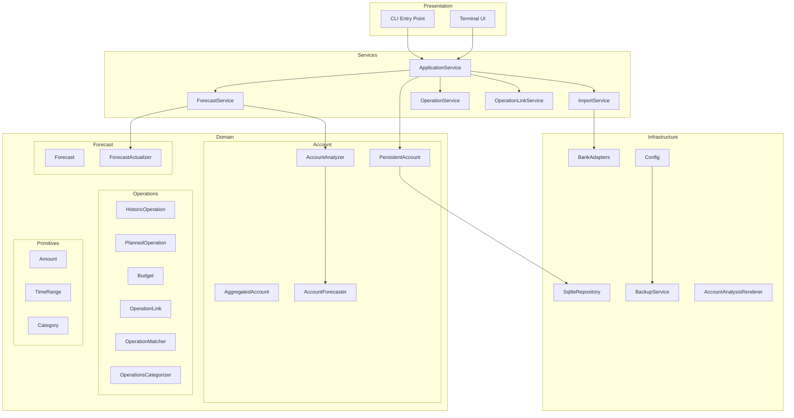

# Architecture Overview

This document describes the high-level architecture of Budget Forecaster.

## Layer Diagram

## Key Invariants

- An operation cannot be linked to multiple targets
- Manual links are never overwritten by heuristic matching
- Balance projection is deterministic given the same inputs

## Configuration

The application uses YAML configuration with:

- **Database path**: SQLite file location
- **Inbox path**: Folder for bank exports (auto-import)
- **Backup settings**: Enable/disable, max backups, rotation
- **Logging**: Python dictConfig format for flexible logging setup

Default configuration is created on first run at
`~/.config/budget-forecaster/config.yaml`.

## Documentation Index

- [Operations & Linking](operations.md) - Operation hierarchy, linking system,
  categorization
- [Forecast](forecast.md) - Forecast structure, actualization algorithm
- [Account](account.md) - Account management, balance projection, bank import
- [Persistence](persistence.md) - Repository interfaces, service layer
