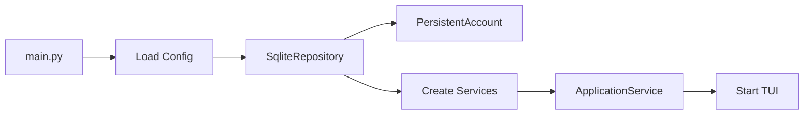

# Architecture Overview

This document describes the high-level architecture of Budget Forecaster.

## Layer Diagram


## Module Responsibilities

### Services Layer

Orchestrates business logic and coordinates between domain objects.

| Component                | Responsibilities                                                                                                                                 |
| ------------------------ | ------------------------------------------------------------------------------------------------------------------------------------------------ |
| **ApplicationService**   | Central orchestrator for TUI. Manages matcher cache, coordinates imports, categorization, and CRUD operations on planned operations and budgets. |
| **ForecastService**      | Loads forecast data, computes account analysis reports, provides aggregated statistics (monthly summaries, category totals).                     |
| **ImportService**        | Handles bank file imports via adapters. Manages inbox folder, deduplicates operations, calculates balance from exports.                          |
| **OperationService**     | CRUD for historic operations. Filtering, category suggestions, and aggregations.                                                                 |
| **OperationLinkService** | Bridges matchers and repository. Implements heuristic linking algorithm with scoring.                                                            |

### Domain Layer

#### Account Management

| Component             | Responsibilities                                                                                           |
| --------------------- | ---------------------------------------------------------------------------------------------------------- |
| **PersistentAccount** | Facade for multi-account management. Loads/saves accounts, merges imported operations, detects duplicates. |
| **AggregatedAccount** | Combines multiple accounts into a single view. Aggregates balances and operations.                         |
| **AccountForecaster** | Computes account state at any target date. Projects future balance using forecast operations.              |

#### Operations

| Component             | Responsibilities                                                                                                |
| --------------------- | --------------------------------------------------------------------------------------------------------------- |
| **HistoricOperation** | Completed bank transaction with unique ID, date, amount, description, category.                                 |
| **PlannedOperation**  | Expected recurring or one-time operation with time range and matcher.                                           |
| **Budget**            | Allocated amount for a category over a time period.                                                             |
| **OperationLink**     | Links a historic operation to a planned operation or budget iteration. Supports manual and automatic links.     |
| **OperationMatcher**  | Encodes matching rules. Scores operations by category, amount tolerance, date proximity, and description hints. |

#### Forecast

| Component              | Responsibilities                                                                                                       |
| ---------------------- | ---------------------------------------------------------------------------------------------------------------------- |
| **Forecast**           | Container for planned operations and budgets.                                                                          |
| **ForecastActualizer** | Updates forecast based on actual operations and links. Handles late iterations, postponements, and budget consumption. |

#### Primitives

| Component             | Responsibilities                                        |
| --------------------- | ------------------------------------------------------- |
| **Amount**            | Immutable money value with currency.                    |
| **TimeRange**         | Single occurrence time period (start + duration).       |
| **PeriodicTimeRange** | Recurring time period with repetition until expiration. |

### Infrastructure Layer

| Component            | Responsibilities                                                            |
| -------------------- | --------------------------------------------------------------------------- |
| **BankAdapters**     | Parse bank export files (BNP, Swile). Extract account info and operations.  |
| **SqliteRepository** | Persistence layer. Implements repository interfaces for all domain objects. |

## Class Relationships

### Operation Hierarchy


### Linking System


### Repository Interfaces


## Data Flows

### Bank Import Flow


### Forecast Computation Flow


### Categorization Flow


## Configuration & Bootstrapping

### Configuration Loading

The application loads configuration from YAML files:

1. `default_config.yaml` (embedded in package) - default values
2. User-provided config file via `-c` flag - overrides defaults

Configuration includes: database path, inbox folder, date formats, and display
preferences.

### Application Bootstrap



`main.py` is the composition root:

- Parses CLI arguments
- Loads configuration
- Instantiates SqliteRepository (single instance)
- Creates all services with their dependencies
- Passes ApplicationService to TUI or executes CLI command

## TUI Structure

The TUI layer uses [Textual](https://textual.textualize.io/) framework.

```
tui/
├── app.py              # BudgetApp - main application, screen routing
├── screens/            # Full-screen views
│   ├── dashboard.py    # Home screen with balance and summary
│   ├── operations.py   # Historic operations list
│   ├── forecast.py     # Forecast visualization
│   ├── planned_operations.py
│   ├── budgets.py
│   └── imports.py      # Inbox file browser
├── modals/             # Overlay dialogs
│   ├── category.py     # Category picker
│   ├── budget_edit.py
│   ├── planned_operation_edit.py
│   ├── link_target.py  # Link operation to target
│   ├── link_iteration.py
│   └── file_browser.py
└── widgets/            # Reusable components
    ├── operation_table.py
    └── category_select.py
```

Screens access domain logic exclusively through ApplicationService. No direct repository
or domain object manipulation from the presentation layer.

## Known Limitations

This section documents architectural decisions that may need revisiting as the project
grows.

### ApplicationService Size

ApplicationService (~640 lines, 40+ methods) acts as a facade for all TUI operations.
This centralizes logic but creates a large class with multiple responsibilities.

**Tracked in**: #118

### Single Repository Implementation

SqliteRepository implements all four repository interfaces. This simplifies the current
architecture but couples all persistence together.

**Trade-off**: Simpler dependency wiring vs. harder to mock individual repositories in
tests.

### Package Organization

Some packages mix concerns:

- `account/` contains domain objects, services, persistence, and presentation logic
- `operation_range/` name doesn't reflect all its contents (includes OperationLink,
  OperationMatcher)
- Primitives (`Amount`, `TimeRange`) sit at package root instead of a dedicated module

**Tracked in**: #119

### OperationLink Target Discrimination

OperationLink uses a `LinkType` enum to distinguish between PlannedOperation and Budget
targets. This requires type-checking code wherever links are processed.

**Tracked in**: #120
