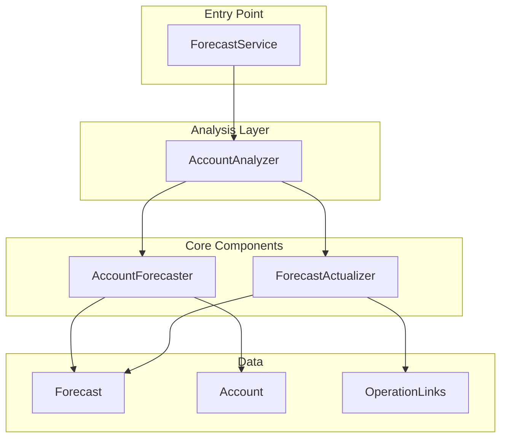
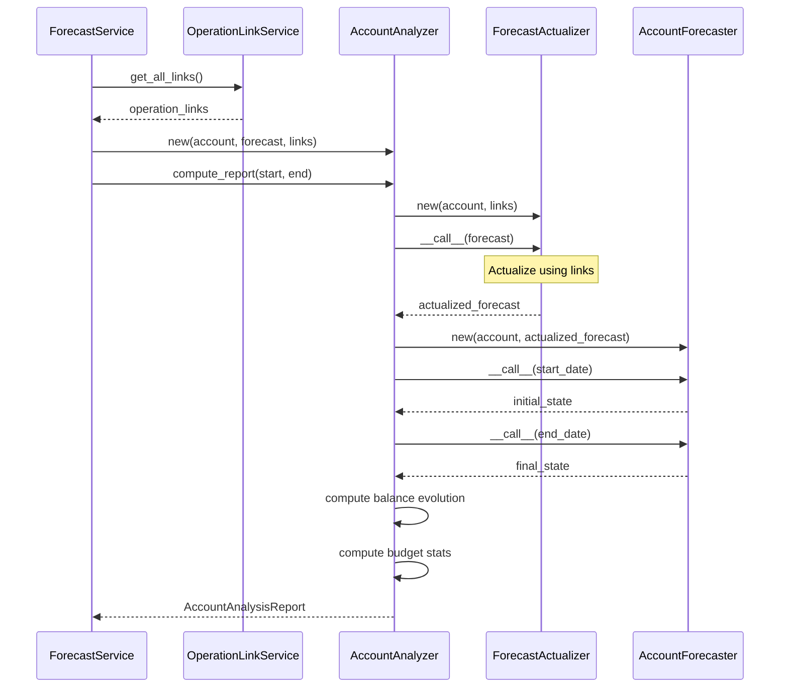
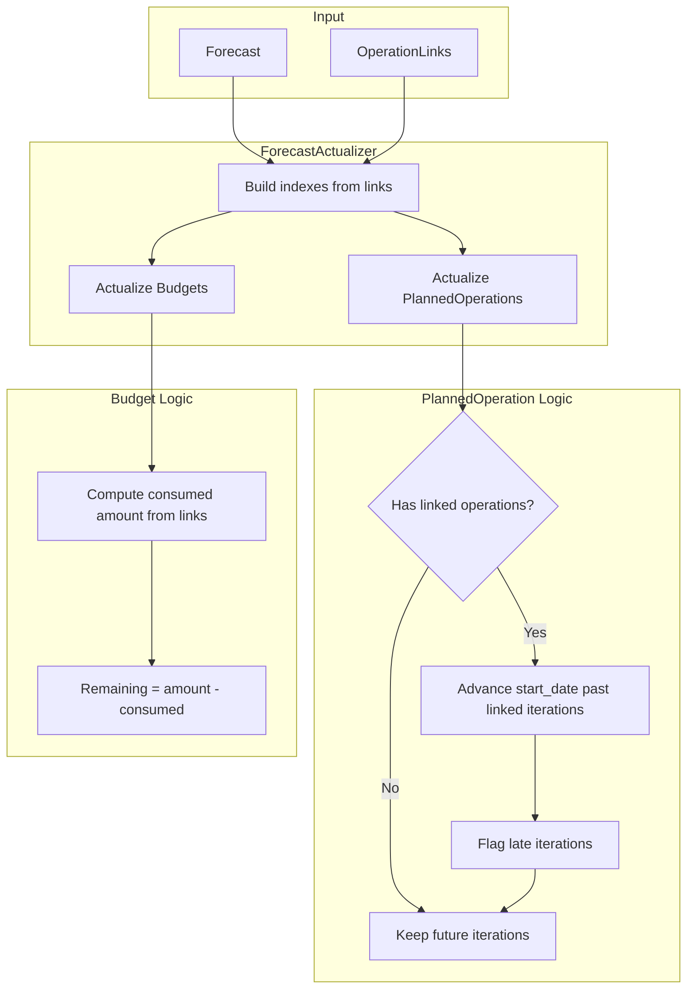
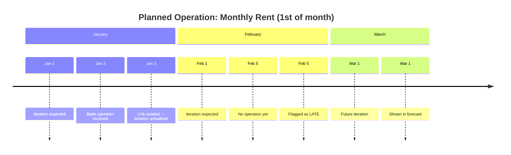
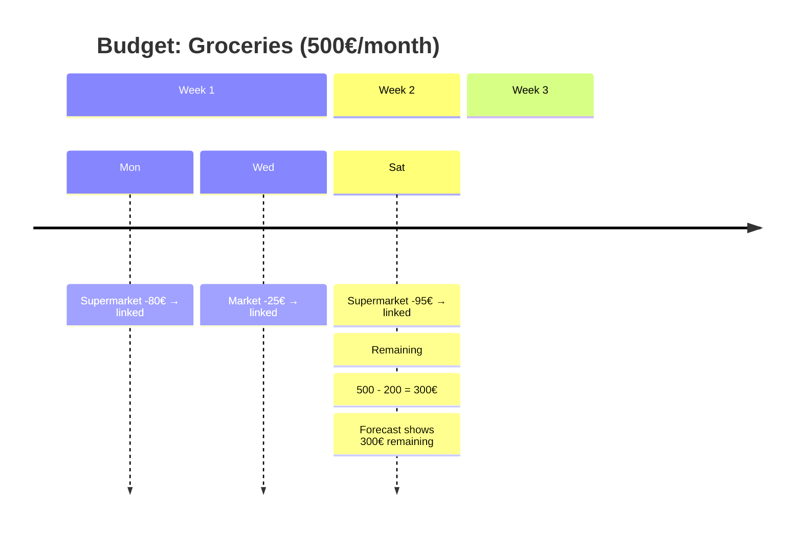

# Forecast Calculation - Developer Documentation

This document describes the architecture and data flow of the forecast calculation
system.

## Overview

The forecast system predicts future account balance by combining:

- **Historic operations**: Real bank transactions (imported)
- **Planned operations**: Expected future transactions (recurring or one-time)
- **Budgets**: Spending limits per category
- **Operation links**: Connections between historic and planned operations

## Architecture



## Key Components

### Forecast

Container for planned operations and budgets.

```python
class Forecast(NamedTuple):
    operations: tuple[PlannedOperation, ...]
    budgets: tuple[Budget, ...]
```

### ForecastActualizer

Transforms a forecast based on what has already happened. Uses operation links to
determine which planned iterations are actualized.

**Responsibilities:**

- Actualize planned operations by advancing past linked iterations
- Compute remaining budget amounts from linked operations
- Flag iterations that should have occurred but have no link (late)

### AccountForecaster

Computes the account state at any given date by combining historic operations with
forecast projections.

**Responsibilities:**

- Compute account state at any target date
- Use historic operations for past dates
- Use forecast projections for future dates

### AccountAnalyzer

Orchestrates the analysis and produces the final report.

**Responsibilities:**

- Generate the full AccountAnalysisReport
- Compute daily balance projections
- Compute budget consumption forecasts
- Compute category spending statistics

## Data Flow

### Report Generation



### Actualization Process



## Role of Operation Links

Operation links are critical for accurate forecast calculation:

### For Planned Operations

1. **Iteration actualization**: A linked iteration is considered "done"
2. **Start date advancement**: Periodic operations advance past linked iterations
3. **Late detection**: Iterations in the past without links are flagged as late



### For Budgets

1. **Consumption tracking**: Linked operations consume budget amount
2. **Remaining calculation**: Budget shows remaining = total - sum(linked operations)



## Link Impact Summary

| Scenario          | Without Links            | With Links                  |
| ----------------- | ------------------------ | --------------------------- |
| Past planned op   | Removed from forecast    | Actualized with real amount |
| Missing iteration | Not detected             | Flagged as LATE             |
| Budget spending   | Not tracked              | Decrements remaining        |
| Forecast accuracy | Based on planned amounts | Based on actual amounts     |

## Key Algorithms

### Late Iteration Detection

An iteration is late if:

1. Its date is in the past (before today)
2. No operation is linked to it
3. It's within the "late window" (configurable)

### Budget Consumption

```python
consumed = sum(
    operation.amount
    for link in links_for_budget
    if link.iteration_date in current_period
)
remaining = budget.amount - consumed
```

### Periodic Operation Advancement

When a periodic operation has linked iterations:

1. Find the latest linked iteration date
2. Advance `start_date` to the next period after that date
3. Future iterations continue from the new start date
