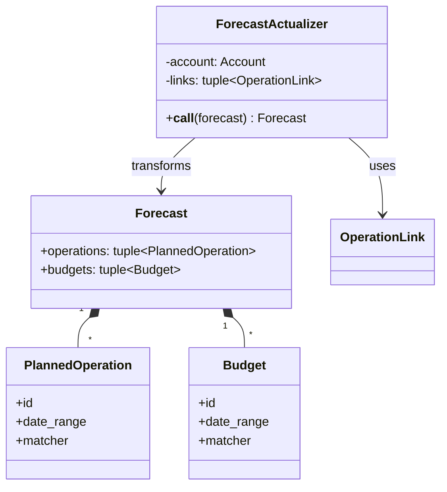
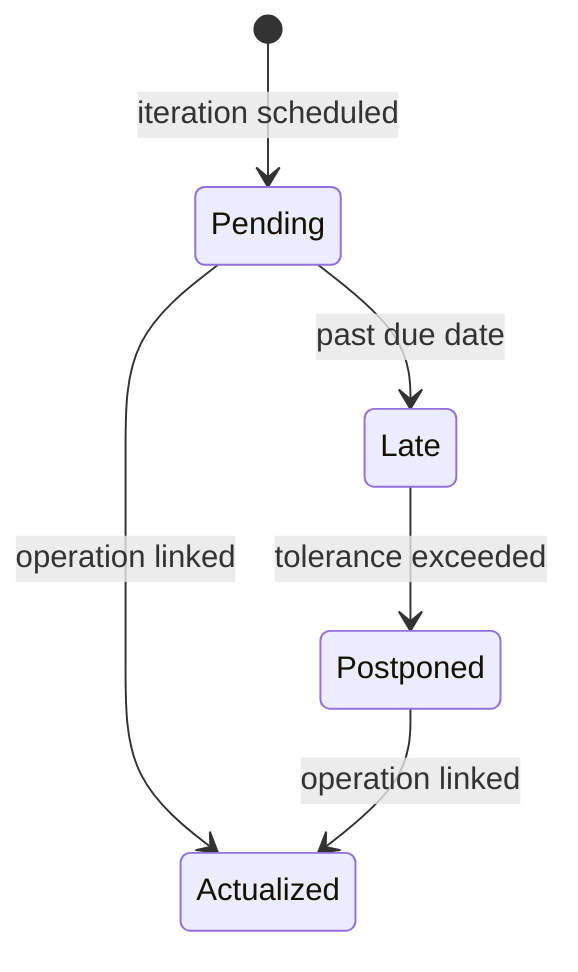
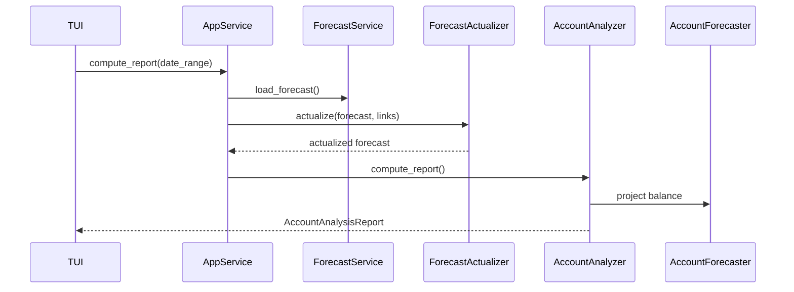
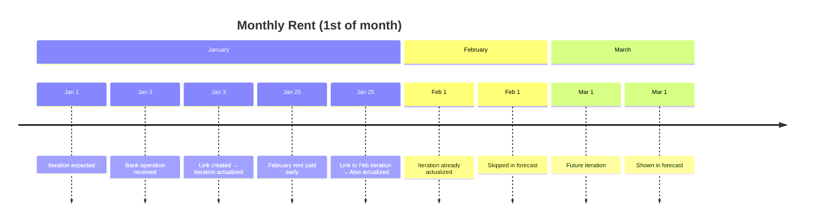
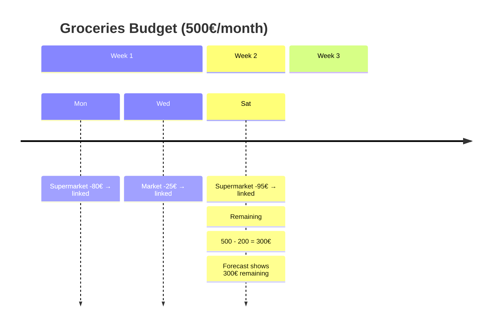
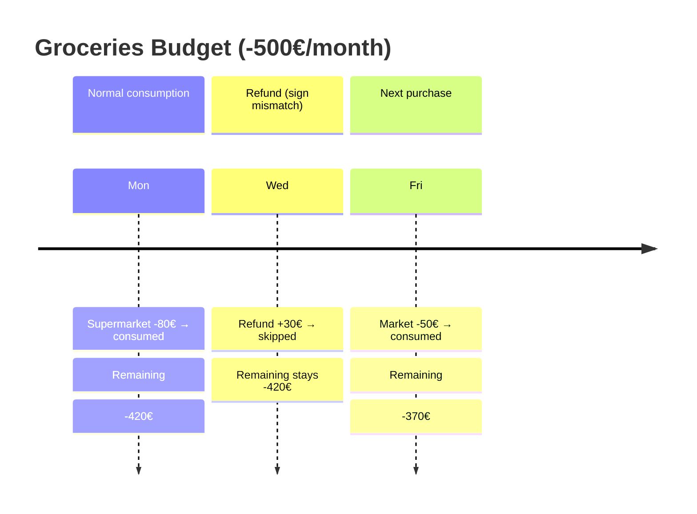

# Forecast

This document describes the forecast system, which manages planned operations and
budgets, and actualizes them based on real transactions.

## Components

ForecastActualizer transforms a raw forecast into an actualized one by examining
operation links. It advances periodic operations past linked iterations, flags late
iterations that should have occurred but weren't linked, and computes remaining budget
amounts from linked operations.

## Actualization Algorithm

## Computation Flow

## Examples

### Planned Operation Actualization

### Budget Consumption

### Budget Sign Matching

A linked operation only consumes a budget when both share the same sign. This preserves
the invariant: **a link can only reduce the remaining budget amount (in absolute value),
never increase it**.

Without this rule, a +30€ refund linked to a -500€ grocery budget would push the
remaining amount to -530€, inflating the forecast beyond the original budget.

| Budget sign | Operation sign | Result                                   |
| ----------- | -------------- | ---------------------------------------- |
| Negative    | Negative       | Consumed (reduces remaining amount)      |
| Positive    | Positive       | Consumed (reduces remaining amount)      |
| Negative    | Positive       | Skipped (would inflate remaining amount) |
| Positive    | Negative       | Skipped (would inflate remaining amount) |

