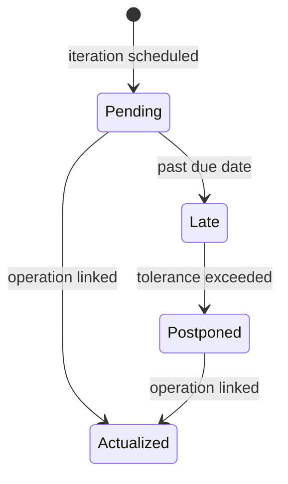
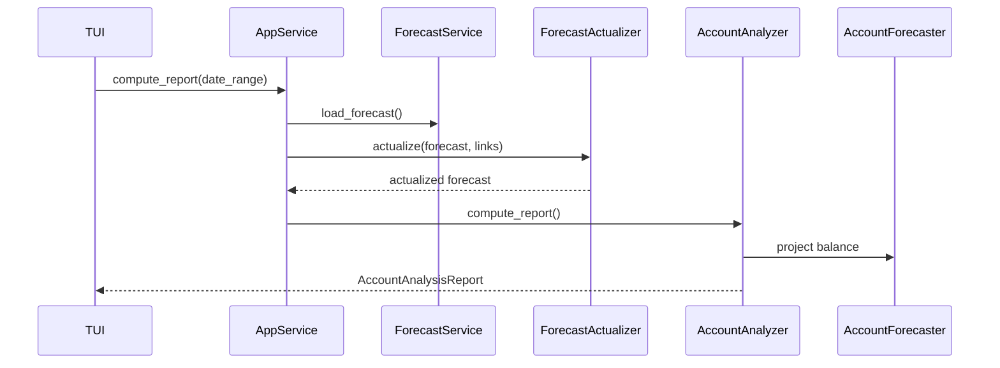

# Forecast

This document describes the forecast system, which manages planned operations and
budgets, and actualizes them based on real transactions.

## Components

| Component              | Responsibilities                                                                             |
| ---------------------- | -------------------------------------------------------------------------------------------- |
| **Forecast**           | Container for planned operations and budgets.                                                |
| **ForecastActualizer** | Updates forecast based on links. Handles late iterations, postponements, budget consumption. |

## Forecast Structure

A Forecast holds:

- **Planned operations**: Expected recurring or one-time transactions
- **Budgets**: Allocated amounts for categories over time periods

Both are loaded from CSV files and stored in the repository.

## Actualization Algorithm

## Computation Flow

