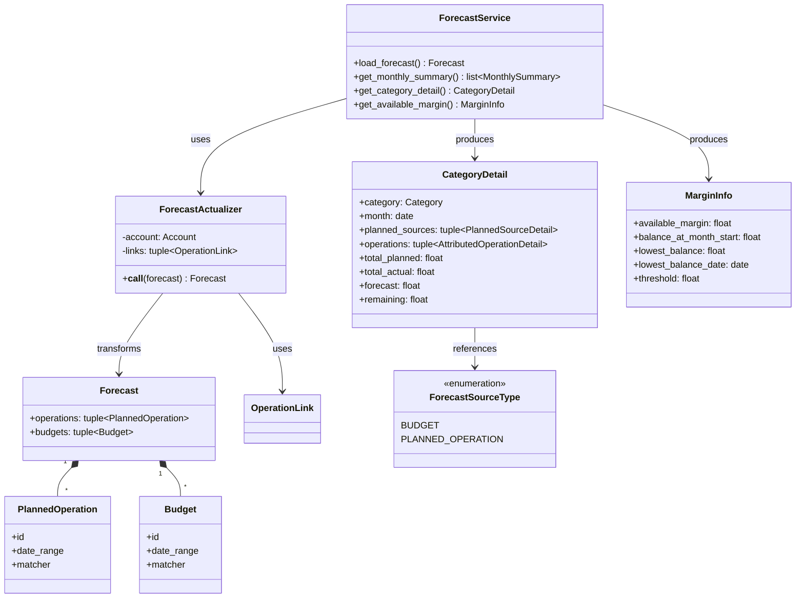
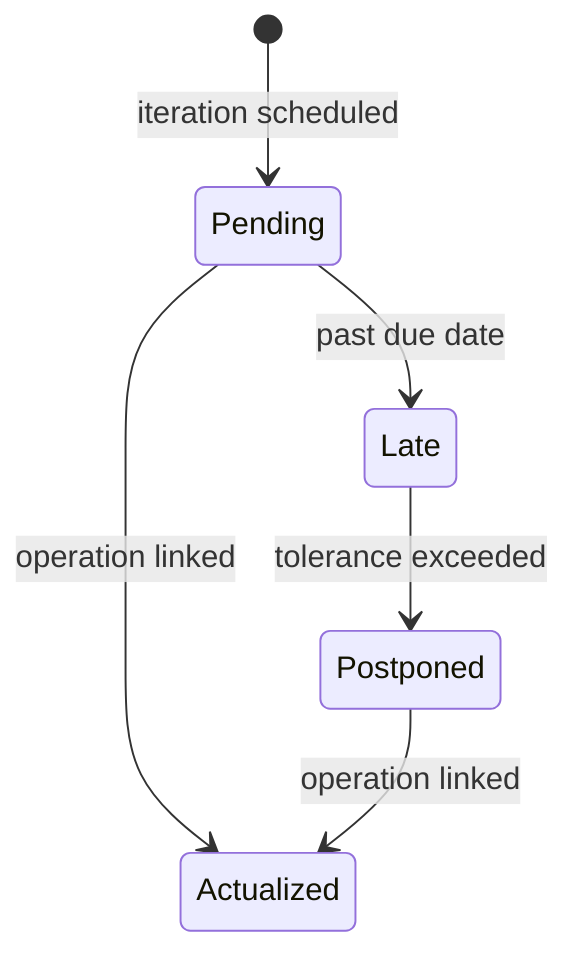
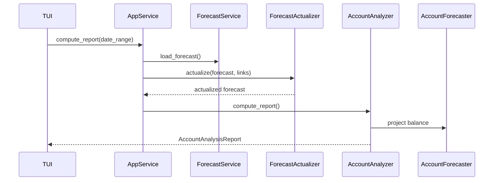
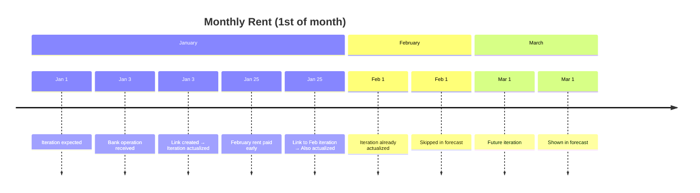
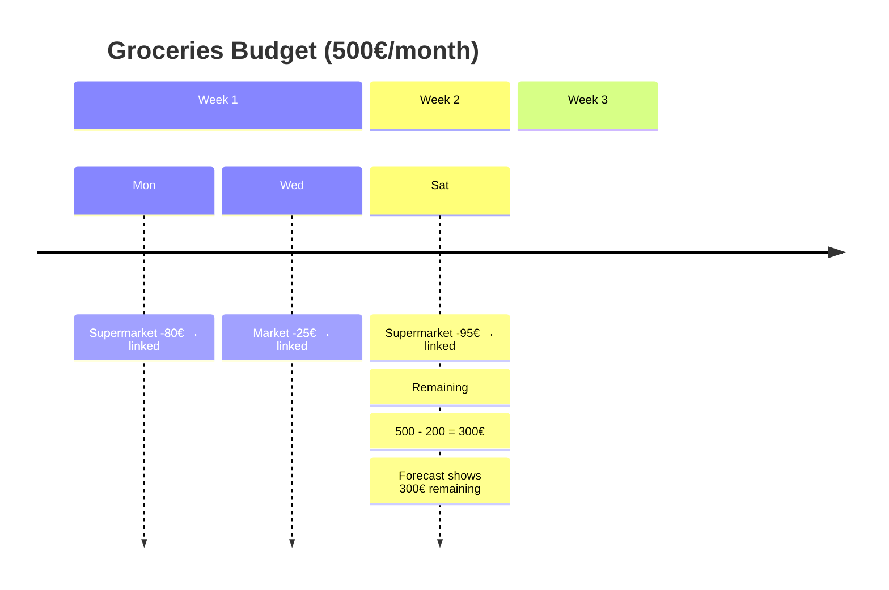
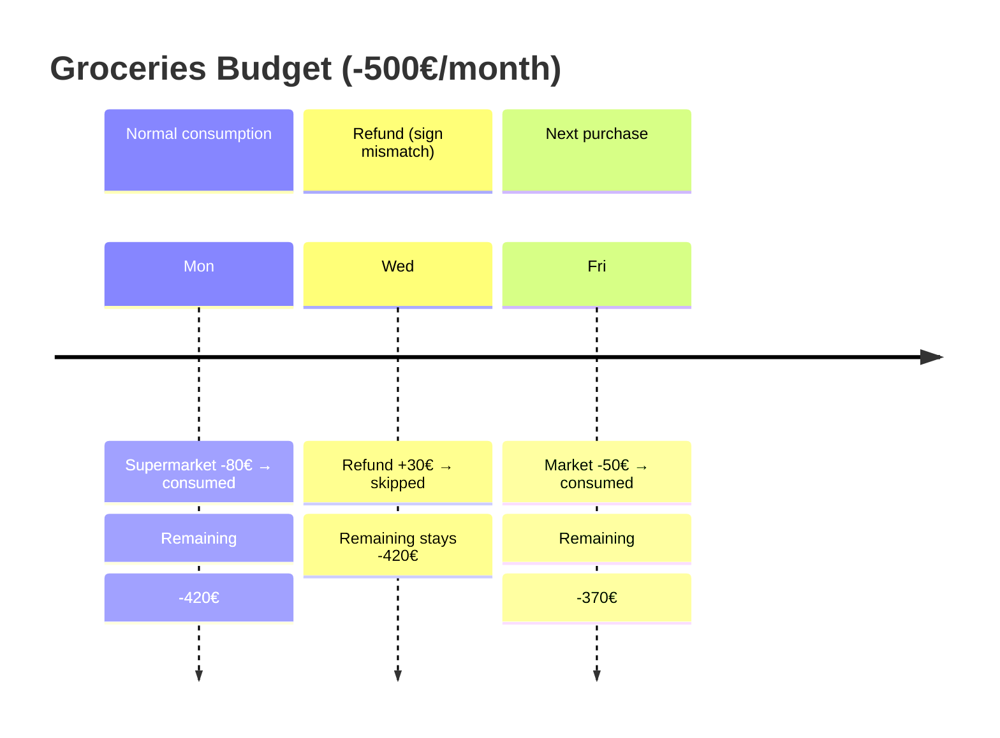

# Forecast

This document describes the forecast system, which manages planned operations and
budgets, and actualizes them based on real transactions.

## Components


```mermaid
classDiagram
    class Forecast {
        +operations: tuple~PlannedOperation~
        +budgets: tuple~Budget~
    }

    class ForecastActualizer {
        -account: Account
        -links: tuple~OperationLink~
        +__call__(forecast) Forecast
    }

    class ForecastService {
        +load_forecast() Forecast
        +get_monthly_summary() list~MonthlySummary~
        +get_category_detail() CategoryDetail
        +get_available_margin() MarginInfo
    }

    class ForecastSourceType {
        <<enumeration>>
        BUDGET
        PLANNED_OPERATION
    }

    class CategoryDetail {
        +category: Category
        +month: date
        +planned_sources: tuple~PlannedSourceDetail~
        +operations: tuple~AttributedOperationDetail~
        +total_planned: float
        +total_actual: float
        +forecast: float
        +remaining: float
    }

    class MarginInfo {
        +available_margin: float
        +balance_at_month_start: float
        +lowest_balance: float
        +lowest_balance_date: date
        +threshold: float
    }

    class PlannedOperation {
        +id
        +date_range
        +matcher
    }

    class Budget {
        +id
        +date_range
        +matcher
    }

    Forecast "1" *-- "*" PlannedOperation
    Forecast "1" *-- "*" Budget
    ForecastActualizer --> Forecast : transforms
    ForecastActualizer --> OperationLink : uses
    ForecastService --> ForecastActualizer : uses
    ForecastService --> CategoryDetail : produces
    ForecastService --> MarginInfo : produces
    CategoryDetail --> ForecastSourceType : references
```

ForecastActualizer transforms a raw forecast into an actualized one by examining
operation links. It advances periodic operations past linked iterations, flags late
iterations that should have occurred but weren't linked, and computes remaining budget
amounts from linked operations.

## Actualization Algorithm


```mermaid
stateDiagram-v2
    [*] --> Pending: iteration scheduled
    Pending --> Actualized: operation linked
    Pending --> Late: past due date
    Late --> Postponed: tolerance exceeded
    Postponed --> Actualized: operation linked
```

## Computation Flow


```mermaid
sequenceDiagram
    participant TUI
    participant AppService
    participant ForecastService
    participant ForecastActualizer
    participant AccountAnalyzer
    participant AccountForecaster

    TUI->>AppService: compute_report(date_range)
    AppService->>ForecastService: load_forecast()
    AppService->>ForecastActualizer: actualize(forecast, links)
    ForecastActualizer-->>AppService: actualized forecast
    AppService->>AccountAnalyzer: compute_report()
    AccountAnalyzer->>AccountForecaster: project balance
    AccountAnalyzer-->>TUI: AccountAnalysisReport
```

## Examples

### Planned Operation Actualization


```mermaid
timeline
    title Monthly Rent (1st of month)
    section January
        Jan 1 : Iteration expected
        Jan 3 : Bank operation received
        Jan 3 : Link created → Iteration actualized
        Jan 25 : February rent paid early
        Jan 25 : Link to Feb iteration → Also actualized
    section February
        Feb 1 : Iteration already actualized
        Feb 1 : Skipped in forecast
    section March
        Mar 1 : Future iteration
        Mar 1 : Shown in forecast
```

### Budget Consumption


```mermaid
timeline
    title Groceries Budget (500€/month)
    section Week 1
        Mon : Supermarket -80€ → linked
        Wed : Market -25€ → linked
    section Week 2
        Sat : Supermarket -95€ → linked
        : Remaining: 500 - 200 = 300€
    section Week 3
        : Forecast shows 300€ remaining
```

### Budget Sign Matching

A linked operation only consumes a budget when both share the same sign. This preserves
the invariant: **a link can only reduce the remaining budget amount (in absolute value),
never increase it**.

Without this rule, a +30€ refund linked to a -500€ grocery budget would push the
remaining amount to -530€, inflating the forecast beyond the original budget.

| Budget sign | Operation sign | Result                                   |
| ----------- | -------------- | ---------------------------------------- |
| Negative    | Negative       | Consumed (reduces remaining amount)      |
| Positive    | Positive       | Consumed (reduces remaining amount)      |
| Negative    | Positive       | Skipped (would inflate remaining amount) |
| Positive    | Negative       | Skipped (would inflate remaining amount) |


```mermaid
timeline
    title Groceries Budget (-500€/month)
    section Normal consumption
        Mon : Supermarket -80€ → consumed
        : Remaining: -420€
    section Refund (sign mismatch)
        Wed : Refund +30€ → skipped
        : Remaining stays -420€
    section Next purchase
        Fri : Market -50€ → consumed
        : Remaining: -370€
```

## Monthly Review

ForecastService provides enriched monthly data for the Review tab.

### Budget Forecast Computation

`AccountAnalyzer.compute_budget_forecast()` produces a DataFrame with per-category,
per-month breakdown. The enriched version includes:

- **Planned** — Total from planned operations and budgets
- **Actual** — Sum of linked operations (link-aware attribution)
- **Forecast** — Projected amount: actual if linked, planned otherwise
- **Source distinction** — Each planned amount tracks whether it comes from a budget
  envelope or a planned operation

Link-aware attribution means operations are attributed to the month of their **linked
iteration**, not their bank date. An operation paid early (e.g. rent paid on Jan 25 for
the Feb iteration) appears in February's actual column.

### Category Detail

`ForecastService.get_category_detail()` returns a `CategoryDetail` TypedDict for
drill-down into a specific category and month:

- **Planned sources** — `PlannedSourceDetail` entries listing each contributing planned
  operation or budget, with its `ForecastSourceType` (BUDGET or PLANNED_OPERATION),
  description, periodicity, and amount
- **Attributed operations** — `AttributedOperationDetail` entries for bank operations
  linked to the category, with cross-month annotations when an operation was paid in a
  different month than its linked iteration

### Available Margin

`ForecastService.get_available_margin()` returns a `MarginInfo` TypedDict:

- Scans the projected balance from the selected month onward
- Finds the lowest future balance and its date
- Computes: `available_margin = lowest_balance - threshold`
- The threshold is stored in the `settings` table (see below)

## Settings Table

Schema V6 introduced a key-value `settings` table for application-level configuration:

```sql
CREATE TABLE settings (
    key TEXT PRIMARY KEY,
    value TEXT NOT NULL
);
```

Currently used for:

- `margin_threshold` — The minimum balance safety net (default: `"0"`)

Access via `SqliteRepository.get_setting(key)` and `set_setting(key, value)`.
