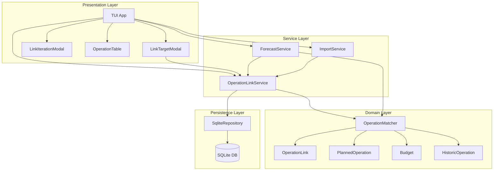
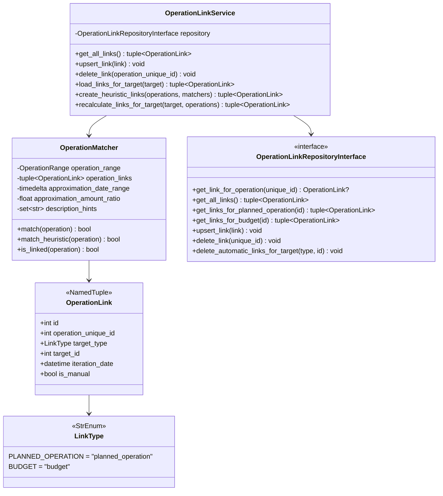
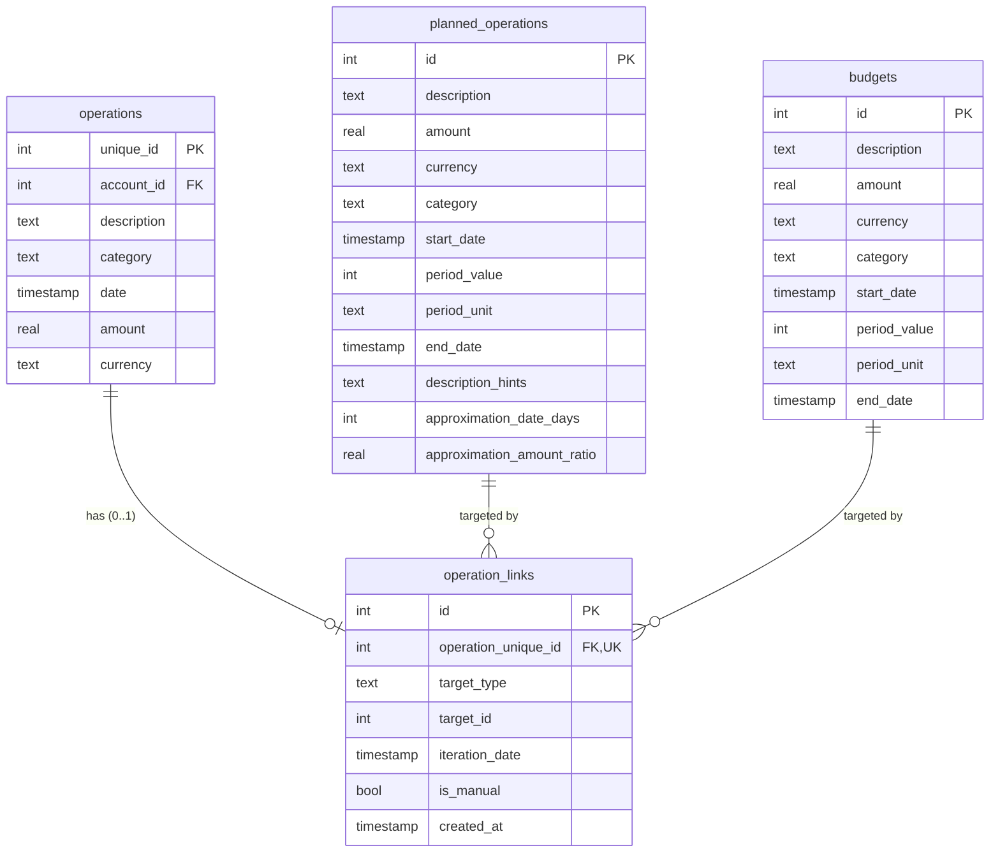
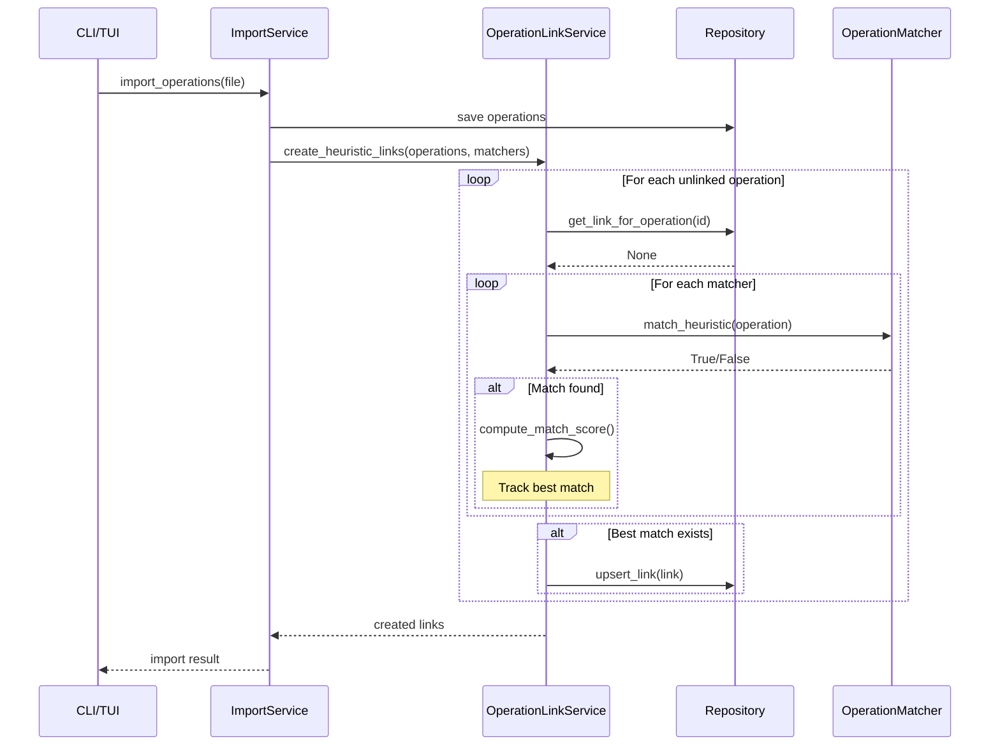
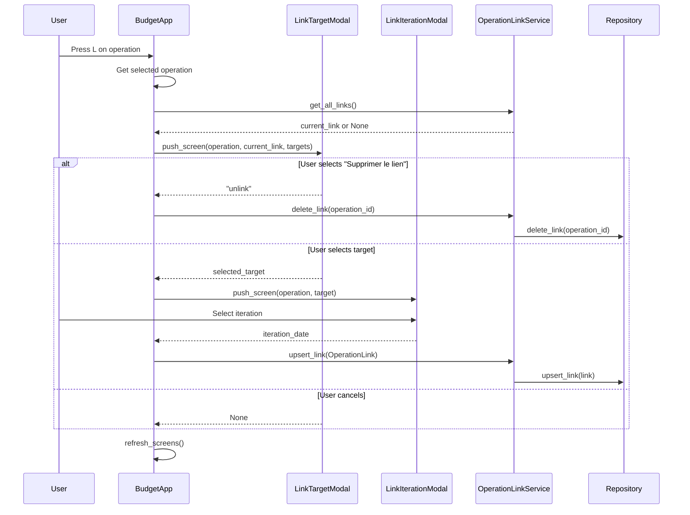
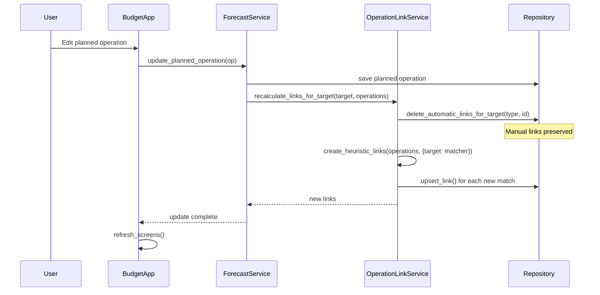
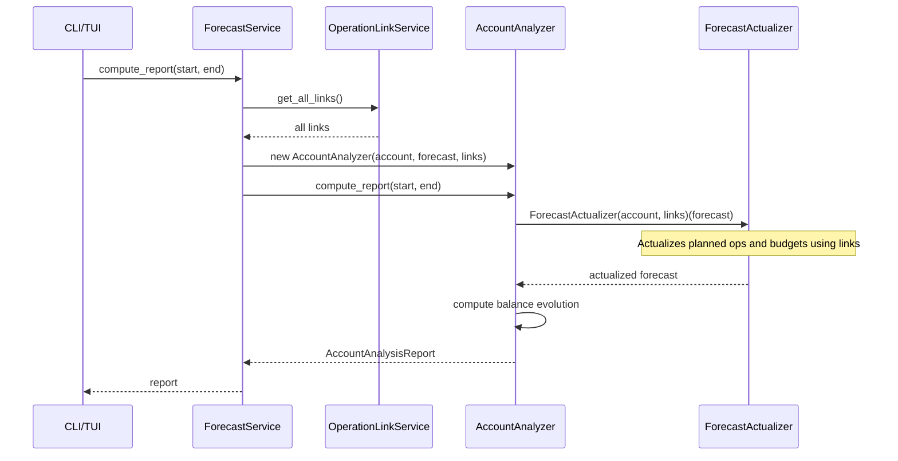
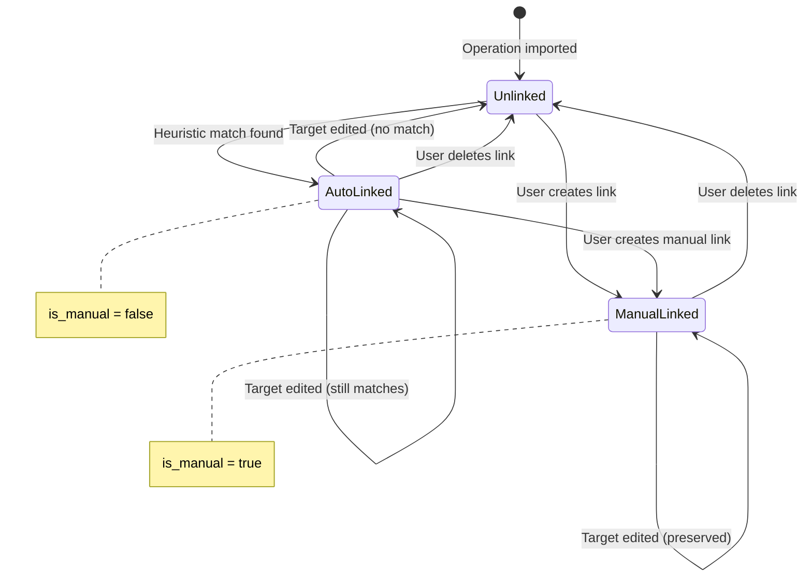

# Operation Links - Developer Documentation

This document describes the architecture and implementation of the operation links
feature, which connects historic bank operations to planned operations or budgets.

## Architecture Overview



## Data Model

### Class Diagram



### Database Schema



**Key constraints:**

- `UNIQUE(operation_unique_id)`: An operation can only have ONE link
- `target_type`: Either `"planned_operation"` or `"budget"`
- `is_manual`: Protects manual links from automatic recalculation

## Key Components

### OperationLink

Immutable NamedTuple representing a link between an operation and a target iteration.

```python
class OperationLink(NamedTuple):
    operation_unique_id: int
    target_type: LinkType
    target_id: int
    iteration_date: datetime
    is_manual: bool = False
    id: int | None = None
```

### OperationMatcher

Handles both link-based and heuristic matching. Links always take priority.

```python
def match(self, operation: HistoricOperation) -> bool:
    # 1. Check operation link first (always wins)
    if self.is_linked(operation):
        return True
    # 2. Fall back to heuristic matching
    return self.match_heuristic(operation)
```

### OperationLinkService

Orchestrates link lifecycle between matchers and repository.

**Responsibilities:**

| Method                           | Purpose                                        |
| -------------------------------- | ---------------------------------------------- |
| `get_all_links()`                | Fetch all links for display                    |
| `upsert_link()`                  | Create or update a link                        |
| `delete_link()`                  | Delete a link by operation ID                  |
| `load_links_for_target()`        | Load links for a specific target               |
| `create_heuristic_links()`       | Create automatic links for unlinked operations |
| `recalculate_links_for_target()` | Refresh links after target edit                |

### Match Score

The `compute_match_score()` function calculates match quality (0-100):

```python
def compute_match_score(
    operation: HistoricOperation,
    operation_range: OperationRange,
    iteration_date: datetime,
) -> float:
    score = 0.0

    # Amount: 40% (only for PlannedOperation, not Budget)
    if not isinstance(operation_range, Budget):
        # ... amount scoring logic

    # Date: 30%
    # ... date proximity scoring

    # Category: 20%
    if operation.category == operation_range.category:
        score += 20.0

    # Description: 10%
    # ... description hints scoring

    return score
```

**Note:** Budgets skip amount scoring because budget amounts represent totals, not
individual operation amounts.

## Data Flows

### 1. Import Operations



### 2. Manual Linking (TUI)



### 3. Edit Planned Operation / Budget



### 4. Forecast Calculation



## Link Lifecycle State Machine



**Key rules:**

- Manual links are never automatically deleted
- Automatic links are recalculated when their target is edited
- User can always override automatic links with manual ones

## Testing Strategy

### Unit Tests

| Component            | Coverage                          |
| -------------------- | --------------------------------- |
| OperationLink        | Dataclass, LinkType enum          |
| OperationMatcher     | Link priority, heuristic fallback |
| OperationLinkService | Service orchestration             |
| SqliteRepository     | Link CRUD, migration              |

### Integration Tests

| Component          | Coverage                |
| ------------------ | ----------------------- |
| ForecastActualizer | Links in actualization  |
| ImportService      | Heuristic link creation |

### Key Scenarios

1. **Link priority**: Linked operation matches even if heuristics fail
2. **Heuristic creation**: Unlinked operation gets automatic link on import
3. **Manual preservation**: Manual link survives target edit
4. **Recalculation**: Automatic links updated when target changes
5. **Forecast impact**: Linked iterations excluded from future forecast
