# Operation Links - Developer Documentation

This document describes the architecture and implementation of the operation links
feature, which connects historic bank operations to planned operations or budgets.

## Architecture Overview


**ApplicationService** is the central orchestrator that:

- Coordinates imports and creates heuristic links afterward
- Manages CRUD for planned operations and budgets with automatic link recalculation
- Caches matchers for efficient link creation
- Handles categorization with potential link creation

## Data Model

### Class Diagram


### Database Schema

```mermaid
erDiagram
    operations {
        int unique_id PK
        int account_id FK
        text description
        text category
        timestamp date
        real amount
        text currency
    }

    planned_operations {
        int id PK
        text description
        real amount
        text currency
        text category
        timestamp start_date
        int period_value
        text period_unit
        timestamp end_date
        text description_hints
        int approximation_date_days
        real approximation_amount_ratio
    }

    budgets {
        int id PK
        text description
        real amount
        text currency
        text category
        timestamp start_date
        int period_value
        text period_unit
        timestamp end_date
    }

    operation_links {
        int id PK
        int operation_unique_id FK,UK
        text target_type
        int target_id
        timestamp iteration_date
        bool is_manual
        timestamp created_at
    }

    operations ||--o| operation_links : "has (0..1)"
    planned_operations ||--o{ operation_links : "targeted by"
    budgets ||--o{ operation_links : "targeted by"
```



**Key constraints:**

- `UNIQUE(operation_unique_id)`: An operation can only have ONE link
- `target_type`: Either `"planned_operation"` or `"budget"`
- `is_manual`: Protects manual links from automatic recalculation

## Key Components

### OperationLink

Immutable NamedTuple representing a link between an operation and a target iteration.

```python
class OperationLink(NamedTuple):
    operation_unique_id: int
    target_type: LinkType
    target_id: int
    iteration_date: datetime
    is_manual: bool = False
    id: int | None = None
```

### OperationMatcher

Handles both link-based and heuristic matching. Links always take priority.

```python
def match(self, operation: HistoricOperation) -> bool:
    # 1. Check operation link first (always wins)
    if self.is_linked(operation):
        return True
    # 2. Fall back to heuristic matching
    return self.match_heuristic(operation)
```

### OperationLinkService

Manages link persistence and heuristic link creation.

**Responsibilities:**

- Fetch all links for display
- Create, update, or delete links
- Load links for a specific target
- Create automatic links for unlinked operations (heuristic matching)
- Delete automatic or all links for a target

### ApplicationService

Central orchestrator that coordinates data flow between services.

**Responsibilities:**

- Coordinate imports and create heuristic links afterward
- Manage CRUD for planned operations and budgets
- Recalculate links when targets are updated (delete automatic + create new)
- Delete ALL links when targets are deleted (including manual links)
- Cache matchers for efficient link creation
- Handle categorization with potential link creation

### Match Score

The `compute_match_score()` function calculates match quality (0-100):

```python
def compute_match_score(
    operation: HistoricOperation,
    operation_range: OperationRange,
    iteration_date: datetime,
) -> float:
    score = 0.0

    # Amount: 40% (only for PlannedOperation, not Budget)
    if not isinstance(operation_range, Budget):
        # ... amount scoring logic

    # Date: 30%
    # ... date proximity scoring

    # Category: 20%
    if operation.category == operation_range.category:
        score += 20.0

    # Description: 10%
    # ... description hints scoring

    return score
```

**Note:** Budgets skip amount scoring because budget amounts represent totals, not
individual operation amounts.

## Data Flows

### 1. Import Operations


### 2. Manual Linking (TUI)


### 3. Edit Planned Operation / Budget


### 4. Forecast Calculation


**Note:** ApplicationService orchestrates report computation by fetching links and
passing them to ForecastService. This decouples the TUI from OperationLinkService.

## Link Lifecycle State Machine


**Key rules:**

- Manual links are never automatically deleted
- Automatic links are recalculated when their target is edited
- User can always override automatic links with manual ones
