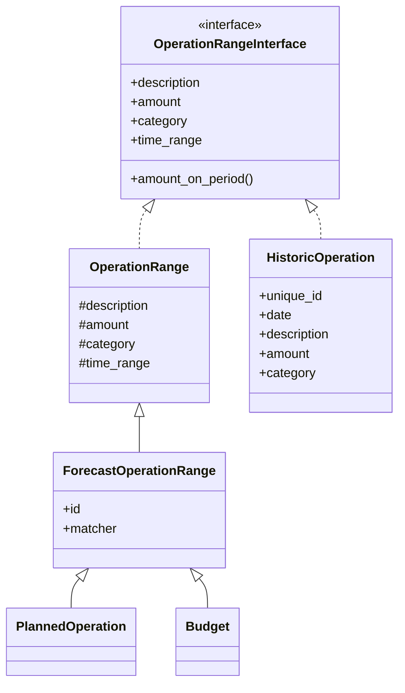
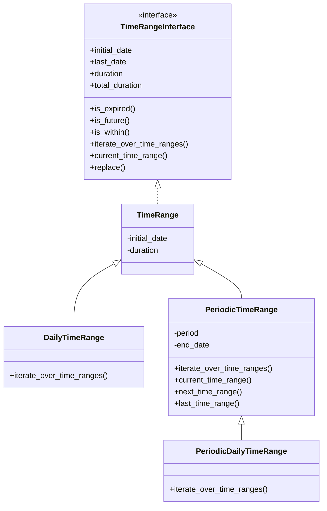
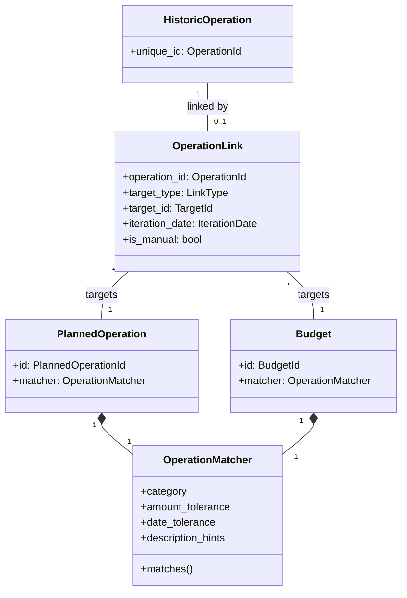
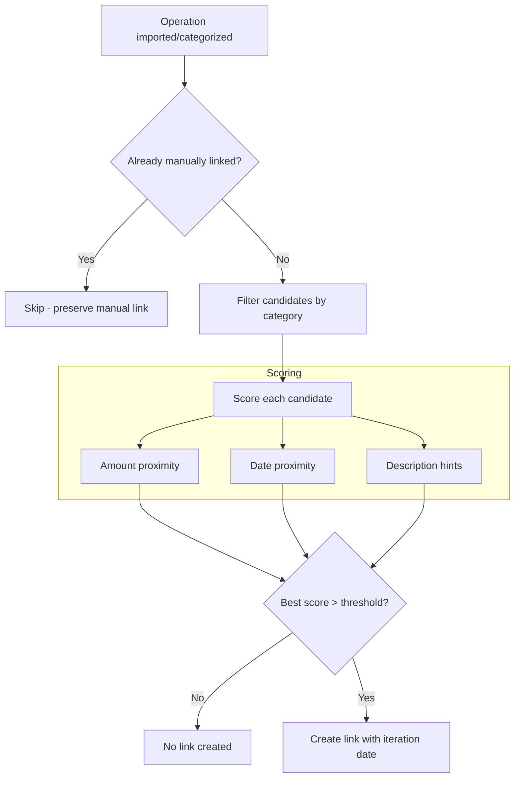
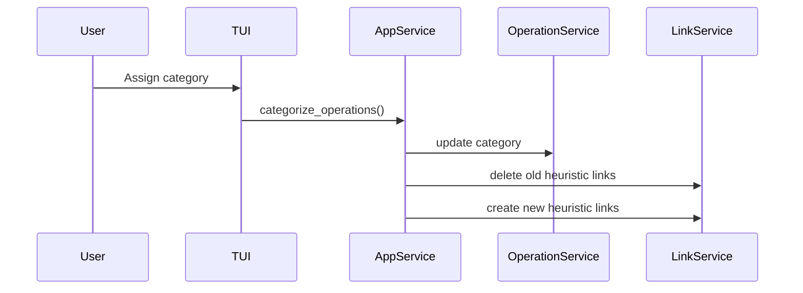
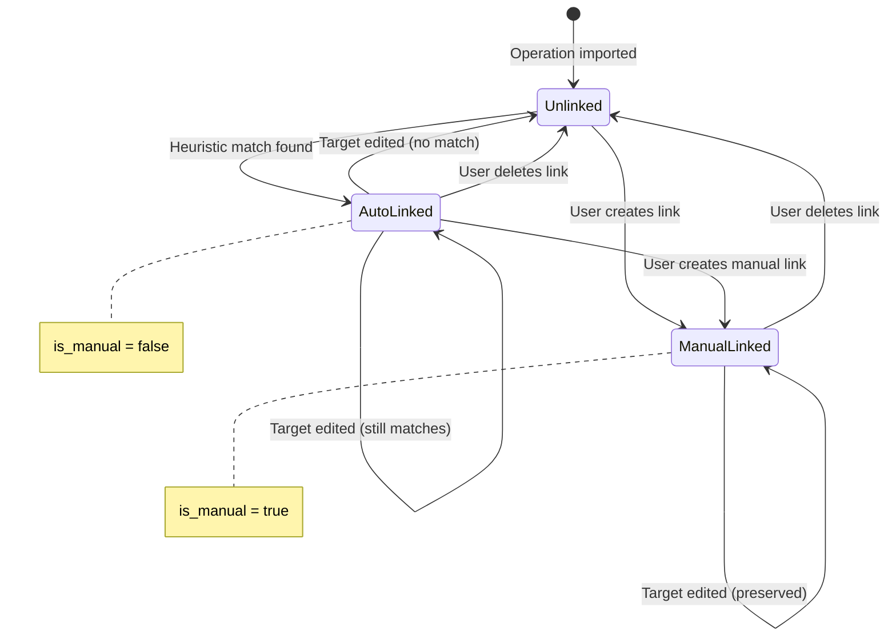

# Operations & Linking

This document describes the operation domain model, time ranges, and the linking system
that connects historic operations to planned operations and budgets.

## Operation Hierarchy

All operations share a common interface for amount calculations over time periods.

| Component                   | Responsibilities                                       |
| --------------------------- | ------------------------------------------------------ |
| **HistoricOperation**       | A completed bank transaction.                          |
| **PlannedOperation**        | Expected recurring or one-time operation with matcher. |
| **Budget**                  | Allocated amount for a category over a time period.    |
| **OperationRangeInterface** | Common interface for amount calculations.              |

## TimeRange Hierarchy

Time ranges define when operations occur and how they repeat.

| Component                  | Responsibilities                                 |
| -------------------------- | ------------------------------------------------ |
| **TimeRange**              | Single time period with start date and duration. |
| **DailyTimeRange**         | Single-day time range.                           |
| **PeriodicTimeRange**      | Repeating time range with configurable period.   |
| **PeriodicDailyTimeRange** | Daily iteration over a periodic range.           |

## Linking System

Links connect historic operations to their planned counterparts or budgets.

| Component            | Responsibilities                                                  |
| -------------------- | ----------------------------------------------------------------- |
| **OperationLink**    | Associates a historic operation to a target iteration.            |
| **OperationMatcher** | Scoring rules for matching (category, amount, date, description). |

### Key Constraint

An operation can be linked to **at most one** planned operation or budget iteration.
This is enforced at the repository level.

## Heuristic Link Matching

## Categorization Flow

## Link Lifecycle

