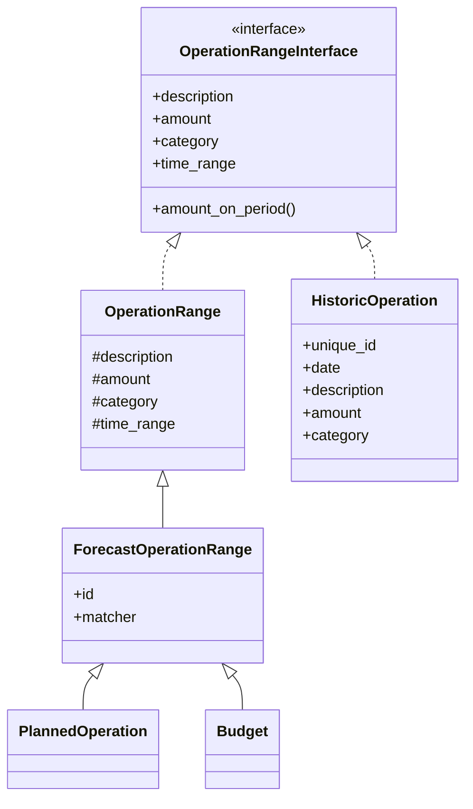
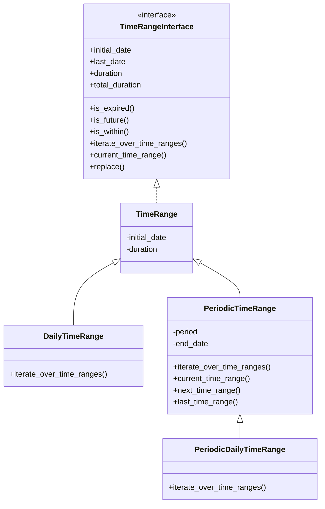
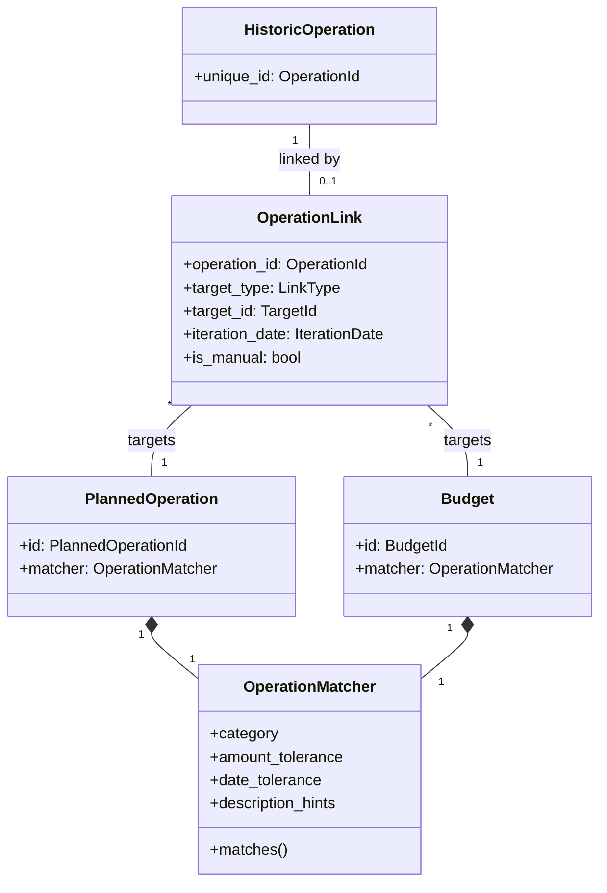
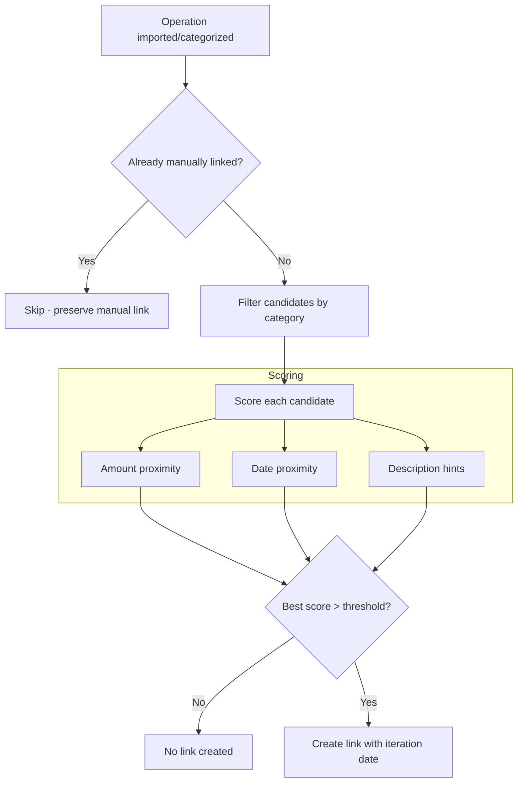
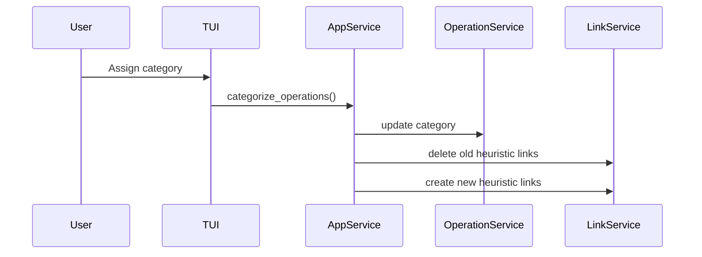
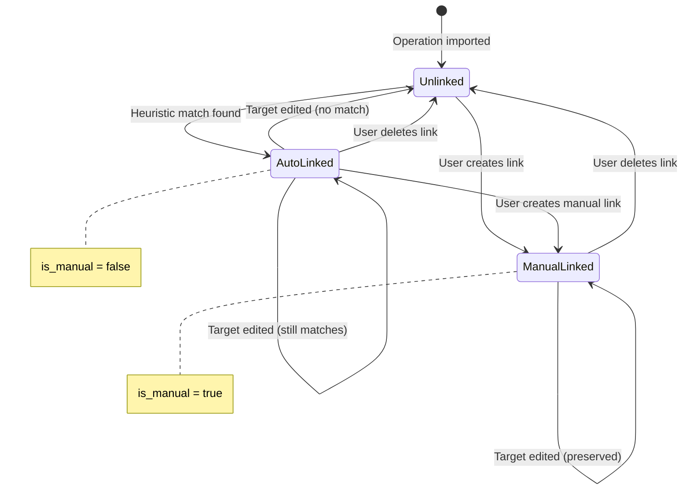
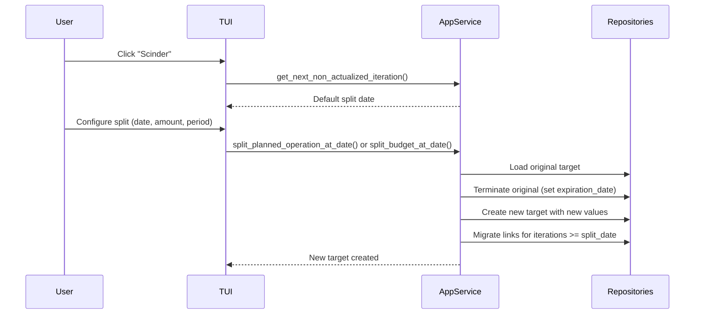
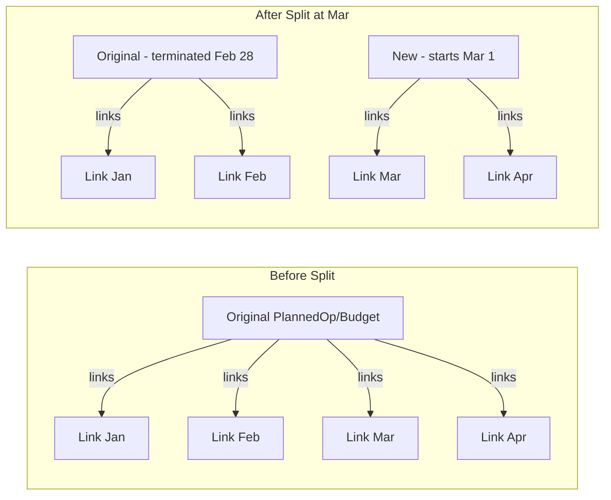

# Operations & Linking

This document describes the operation domain model, time ranges, and the linking system
that connects historic operations to planned operations and budgets.

## Operation Hierarchy

All operations share a common interface for amount calculations over time periods.

HistoricOperation represents actual bank transactions (imported). PlannedOperation and
Budget represent expected future activity and include an OperationMatcher for automatic
linking. All share amount_on_period() which computes the amount over any time slice.

## TimeRange Hierarchy

Time ranges define when operations occur and how they repeat.

PeriodicTimeRange enables recurring operations (monthly rent, weekly groceries) by
generating iterations via iterate_over_time_ranges(). DailyTimeRange is used for
one-time operations on a specific date.

## Linking System

Links connect historic operations to their planned counterparts or budgets.

OperationMatcher uses configurable tolerances (amount ratio, date window) and
description hints to score potential matches. The is_manual flag on OperationLink
distinguishes user-created links (protected) from heuristic ones (recalculated on target
changes).

### Key Constraint

An operation can be linked to **at most one** planned operation or budget iteration.
This is enforced at the repository level.

## Heuristic Link Matching

## Categorization Flow

## Link Lifecycle

## Splitting Operations and Budgets

Split functionality allows users to modify recurring planned operations or budgets from
a specific date while preserving historical data.

### Split Process

### Split Data Flow

### Key Behaviors

- **Termination**: Original element's `expiration_date` is set to `split_date - 1 day`
- **Creation**: New element inherits the original's description and category
- **Link Migration**: All links with `iteration_date >= split_date` are moved to the new
  target. The `target_id` is updated; `target_type` and `iteration_date` remain
  unchanged.
- **Manual links preserved**: Both manual and automatic links are migrated

### Validation Rules

- Split date must be strictly after the original's `initial_date`
- Target must have a periodic time range (`PeriodicTimeRange` or
  `PeriodicDailyTimeRange`)
- Non-periodic elements cannot be split

### ApplicationService Methods

- `get_next_non_actualized_iteration(target_type, target_id)`: Finds the first iteration
  without a linked operation (used as default split date)
- `split_planned_operation_at_date(operation_id, split_date, new_amount, new_period)`:
  Splits a PlannedOperation
- `split_budget_at_date(budget_id, split_date, new_amount, new_period, new_duration)`:
  Splits a Budget (includes duration parameter)
