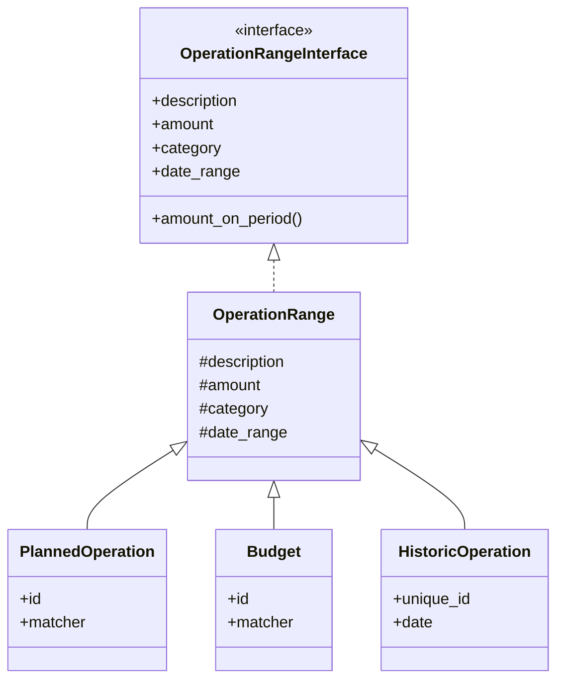
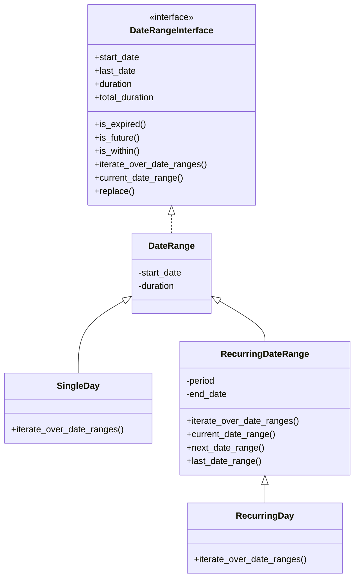
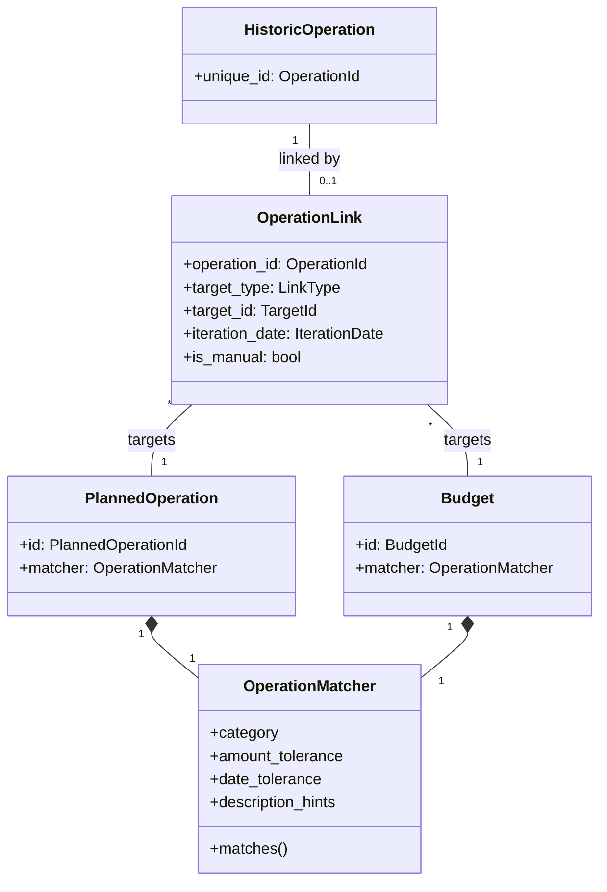
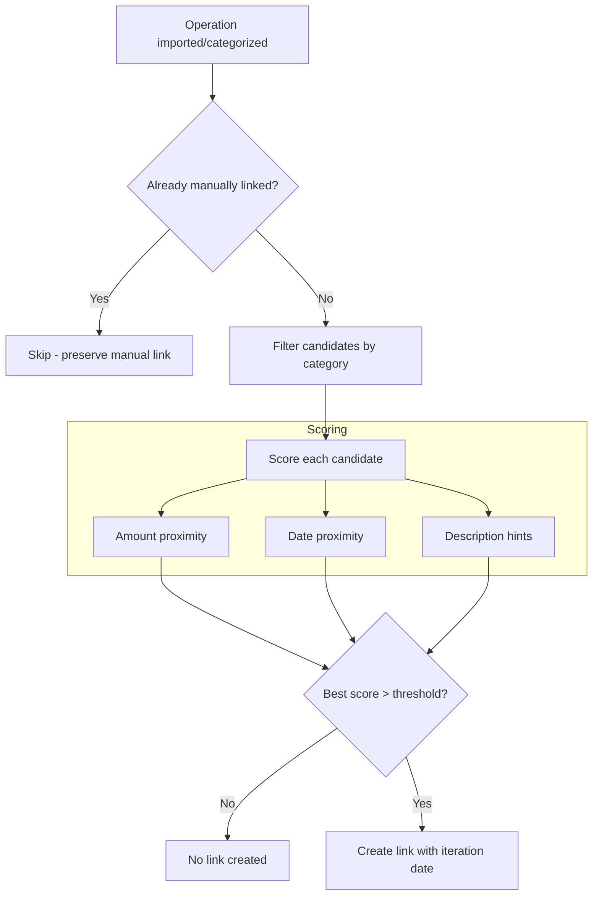
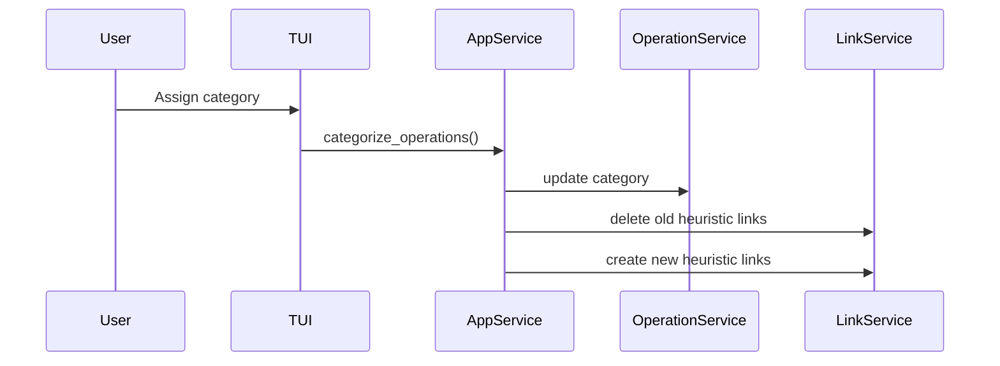
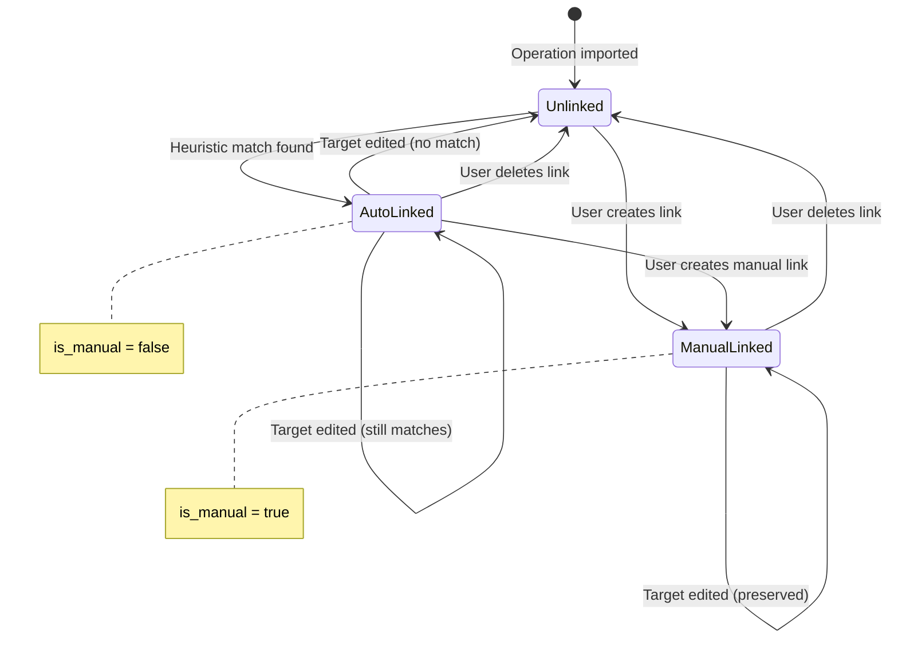

# Operations & Linking

This document describes the operation domain model, time ranges, and the linking system
that connects historic operations to planned operations and budgets.

## Operation Hierarchy

All operations share a common interface for amount calculations over time periods.

HistoricOperation represents actual bank transactions (imported). PlannedOperation and
Budget represent expected future activity and include an OperationMatcher for automatic
linking. All share amount_on_period() which computes the amount over any time slice.

## DateRange Hierarchy

Date ranges define when operations occur and how they repeat.

RecurringDateRange enables recurring operations (monthly rent, weekly groceries) by
generating iterations via iterate_over_date_ranges(). SingleDay is used for one-time
operations on a specific date.

## Linking System

Links connect historic operations to their planned counterparts or budgets.

OperationMatcher uses configurable tolerances (amount ratio, date window) and
description hints to score potential matches. The is_manual flag on OperationLink
distinguishes user-created links (protected) from heuristic ones (recalculated on target
changes).

### Key Constraint

An operation can be linked to **at most one** planned operation or budget iteration.
This is enforced at the repository level.

## Heuristic Link Matching

## Categorization Flow

## Link Lifecycle

## Related Documentation

- [Planned Operations & Budgets](planned-operations-budgets.md) - Split functionality
  and management operations
