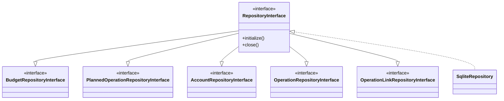
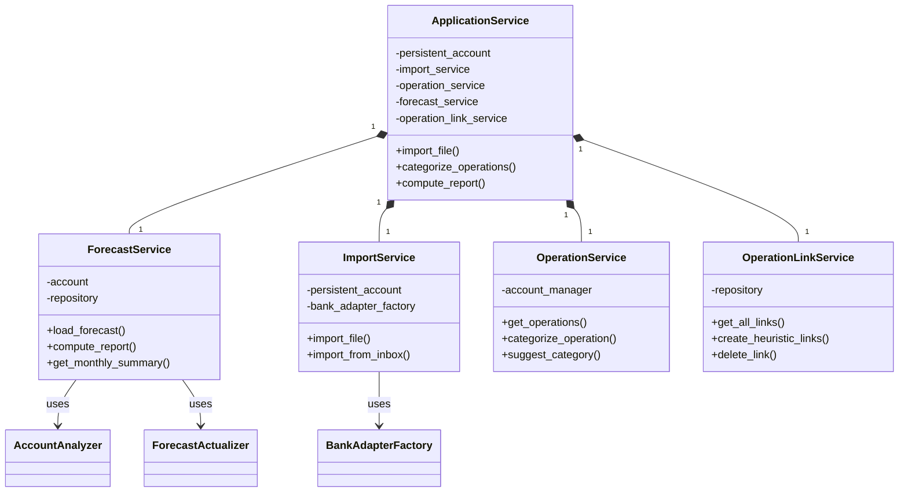

# Persistence Layer

This document describes the repository pattern and service layer architecture.

## Repository Interfaces (ISP)

The repository layer follows the Interface Segregation Principle. Each entity has its
own interface, and `RepositoryInterface` is a facade that combines them all.

| Interface                               | Responsibilities                             |
| --------------------------------------- | -------------------------------------------- |
| **BudgetRepositoryInterface**           | CRUD for budgets.                            |
| **PlannedOperationRepositoryInterface** | CRUD for planned operations.                 |
| **AccountRepositoryInterface**          | Account and aggregated account management.   |
| **OperationRepositoryInterface**        | Historic operation updates.                  |
| **OperationLinkRepositoryInterface**    | Link management (create, delete, query).     |
| **RepositoryInterface**                 | Facade combining all interfaces + lifecycle. |

### Why ISP?

Services can depend on only the interface they need:

- `OperationLinkService` depends on `OperationLinkRepositoryInterface`
- `ForecastService` depends on `BudgetRepositoryInterface` and
  `PlannedOperationRepositoryInterface`

This reduces coupling and makes testing easier.

## Service Layer

Services orchestrate business logic and coordinate between domain objects.

| Service                  | Responsibilities                                                                          |
| ------------------------ | ----------------------------------------------------------------------------------------- |
| **ApplicationService**   | Central facade for TUI. Manages matcher cache, coordinates imports, categorization, CRUD. |
| **ForecastService**      | Loads forecast data, computes reports, provides statistics.                               |
| **ImportService**        | Handles bank file imports. Manages inbox folder, deduplicates operations.                 |
| **OperationService**     | CRUD for historic operations. Filtering, category suggestions.                            |
| **OperationLinkService** | Implements heuristic linking algorithm. Bridges matchers and repository.                  |

## Infrastructure Components

| Component                   | Responsibilities                                                 |
| --------------------------- | ---------------------------------------------------------------- |
| **SqliteRepository**        | SQLite implementation of all repository interfaces.              |
| **BankAdapters**            | Parse bank export files (BNP Excel, Swile JSON).                 |
| **Config**                  | YAML configuration loading and logging setup.                    |
| **BackupService**           | Automatic database backups with rotation.                        |
| **AccountAnalysisRenderer** | Excel export with charts (balance evolution, expense breakdown). |
