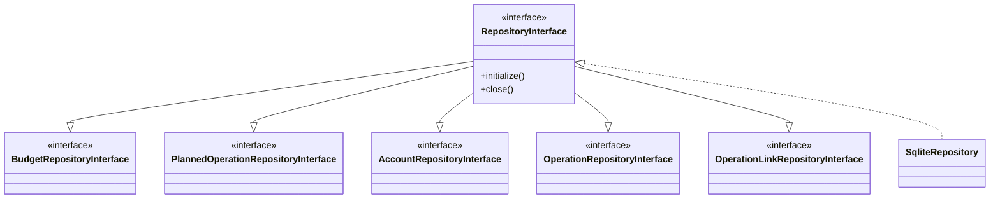
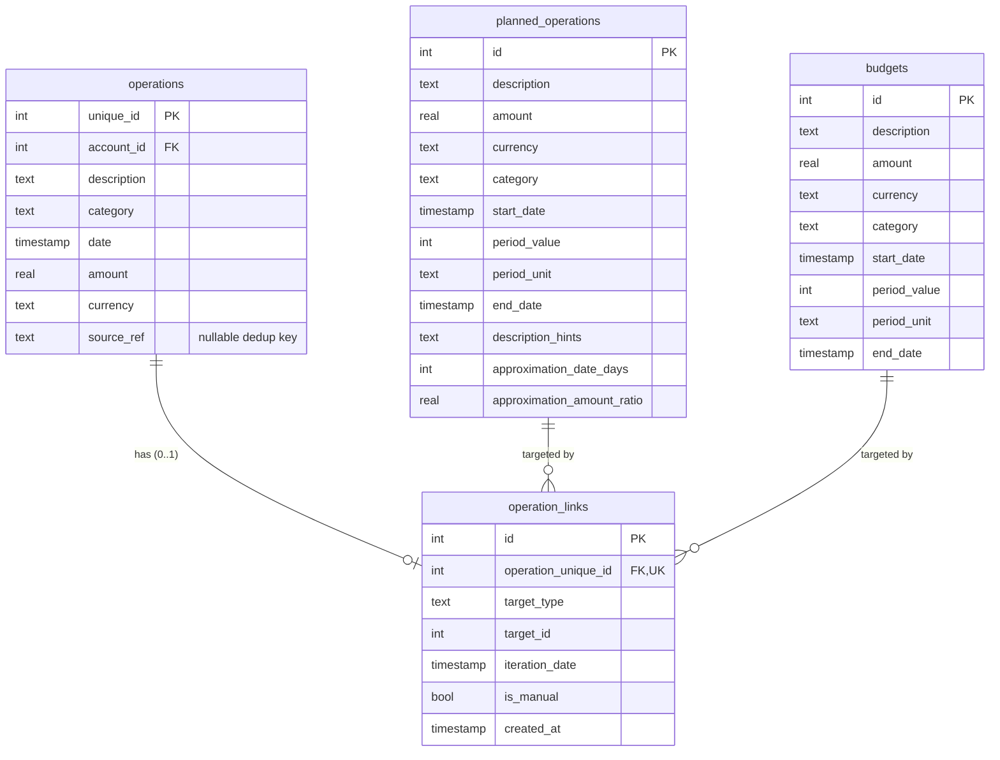
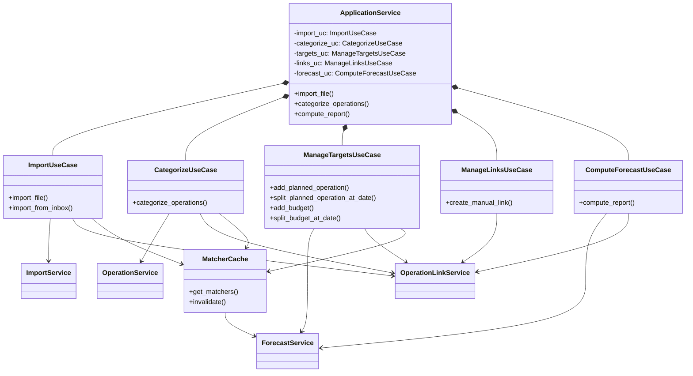

# Persistence Layer

This document describes the repository pattern and service layer architecture.

## Repository Interfaces (ISP)

The repository layer follows the Interface Segregation Principle. Each entity has its
own interface, and `RepositoryInterface` is a facade that combines them all.

```mermaid
classDiagram
    class RepositoryInterface {
        <<interface>>
        +initialize()
        +close()
    }

    class BudgetRepositoryInterface {
        <<interface>>
    }

    class PlannedOperationRepositoryInterface {
        <<interface>>
    }

    class AccountRepositoryInterface {
        <<interface>>
    }

    class OperationRepositoryInterface {
        <<interface>>
    }

    class OperationLinkRepositoryInterface {
        <<interface>>
    }

    class SqliteRepository

    RepositoryInterface --|> BudgetRepositoryInterface
    RepositoryInterface --|> PlannedOperationRepositoryInterface
    RepositoryInterface --|> AccountRepositoryInterface
    RepositoryInterface --|> OperationRepositoryInterface
    RepositoryInterface --|> OperationLinkRepositoryInterface
    RepositoryInterface <|.. SqliteRepository
```

Each interface handles CRUD for a specific entity. RepositoryInterface is the facade
that combines them all and adds lifecycle methods (initialize/close).

### Why ISP?

Services can depend on only the interface they need:

- `OperationLinkService` depends on `OperationLinkRepositoryInterface`
- `ForecastService` depends on `BudgetRepositoryInterface` and
  `PlannedOperationRepositoryInterface`

This reduces coupling and makes testing easier.

## Database Schema

```mermaid
erDiagram
    operations {
        int unique_id PK
        int account_id FK
        text description
        text category
        timestamp date
        real amount
        text currency
        text source_ref "nullable dedup key"
    }

    planned_operations {
        int id PK
        text description
        real amount
        text currency
        text category
        timestamp start_date
        int period_value
        text period_unit
        timestamp end_date
        text description_hints
        int approximation_date_days
        real approximation_amount_ratio
    }

    budgets {
        int id PK
        text description
        real amount
        text currency
        text category
        timestamp start_date
        int period_value
        text period_unit
        timestamp end_date
    }

    operation_links {
        int id PK
        int operation_unique_id FK,UK
        text target_type
        int target_id
        timestamp iteration_date
        bool is_manual
        timestamp created_at
    }

    operations ||--o| operation_links : "has (0..1)"
    planned_operations ||--o{ operation_links : "targeted by"
    budgets ||--o{ operation_links : "targeted by"
```

## Schema Migrations

The schema is versioned. On open, `initialize()` applies each pending migration in order
up to the current version, so an older database is upgraded transparently. Migrations
are ordered steps held in a single registry.

Version 8 added the `source_ref` column on operations, the natural deduplication key.

## Deduplication

An operation carries a `source_ref` when its source provides a stable reference:

- API operations use the bank's entry reference.
- File imports (BNP, Swile) leave it NULL; a content reference (a hash of date, amount
  and description) is derived on the fly instead.

An incoming operation is a duplicate when any of these hold:

- it has a reference and that reference is already stored for the account, or
- its content reference matches a stored operation, or
- it reconciles with a cross-source operation by signed amount and a date within a few
  days.

The last rule handles the real cross-source case: the same transaction gets a different
description from a file export and from the API, so the content references differ and
only amount and date line up. Cross-source matching is one-to-one and fires only between
a file operation and an API operation, so two same-source operations sharing an amount
and date stay distinct (two identical same-day API operations are both kept).

When a file operation and an API operation reconcile, the API operation is kept (cleaner
description and stable reference) and the file operation is dropped. The API source
carries no category, so the surviving operation adopts the file's category; the file
operation's link moves to the survivor, keeping the forecast's actual attributions
without waiting for a link recompute.

Version 10 applies the same collapse to duplicates already stored in existing databases.

## Service Layer

Services orchestrate business logic and coordinate between domain objects.

```mermaid
classDiagram
    class ApplicationService {
        -import_uc: ImportUseCase
        -categorize_uc: CategorizeUseCase
        -targets_uc: ManageTargetsUseCase
        -links_uc: ManageLinksUseCase
        -forecast_uc: ComputeForecastUseCase
        +import_file()
        +categorize_operations()
        +compute_report()
    }

    class ImportUseCase {
        +import_file()
        +import_from_inbox()
    }

    class CategorizeUseCase {
        +categorize_operations()
    }

    class ManageTargetsUseCase {
        +add_planned_operation()
        +split_planned_operation_at_date()
        +add_budget()
        +split_budget_at_date()
    }

    class ManageLinksUseCase {
        +create_manual_link()
    }

    class ComputeForecastUseCase {
        +compute_report()
    }

    class MatcherCache {
        +get_matchers()
        +invalidate()
    }

    class ForecastService
    class ImportService
    class OperationService
    class OperationLinkService

    ApplicationService *-- ImportUseCase
    ApplicationService *-- CategorizeUseCase
    ApplicationService *-- ManageTargetsUseCase
    ApplicationService *-- ManageLinksUseCase
    ApplicationService *-- ComputeForecastUseCase
    ImportUseCase --> ImportService
    ImportUseCase --> OperationLinkService
    ImportUseCase --> MatcherCache
    CategorizeUseCase --> OperationService
    CategorizeUseCase --> OperationLinkService
    CategorizeUseCase --> MatcherCache
    ManageTargetsUseCase --> ForecastService
    ManageTargetsUseCase --> OperationLinkService
    ManageTargetsUseCase --> MatcherCache
    ManageLinksUseCase --> OperationLinkService
    ComputeForecastUseCase --> ForecastService
    ComputeForecastUseCase --> OperationLinkService
    MatcherCache --> ForecastService
```

ApplicationService is a thin facade for the TUI, delegating orchestration to focused use
case classes. Each use case encapsulates a specific workflow and coordinates the
lower-level services it needs. MatcherCache is a shared dependency providing lazy-loaded
operation matchers for efficient link creation.
