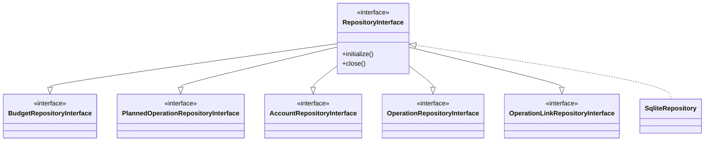

# Persistence Layer

This document describes the repository pattern and service layer architecture.

## Repository Interfaces (ISP)

The repository layer follows the Interface Segregation Principle. Each entity has its
own interface, and `RepositoryInterface` is a facade that combines them all.

Each interface handles CRUD for a specific entity. RepositoryInterface is the facade
that combines them all and adds lifecycle methods (initialize/close).

### Why ISP?

Services can depend on only the interface they need:

- `OperationLinkService` depends on `OperationLinkRepositoryInterface`
- `ForecastService` depends on `BudgetRepositoryInterface` and
  `PlannedOperationRepositoryInterface`

This reduces coupling and makes testing easier.

## Database Schema

## Service Layer

Services orchestrate business logic and coordinate between domain objects.

ApplicationService is the central facade for the TUI, coordinating all operations and
caching matchers for efficient link creation. The other services handle specific
concerns: imports, forecasts, operations CRUD, and link management.
