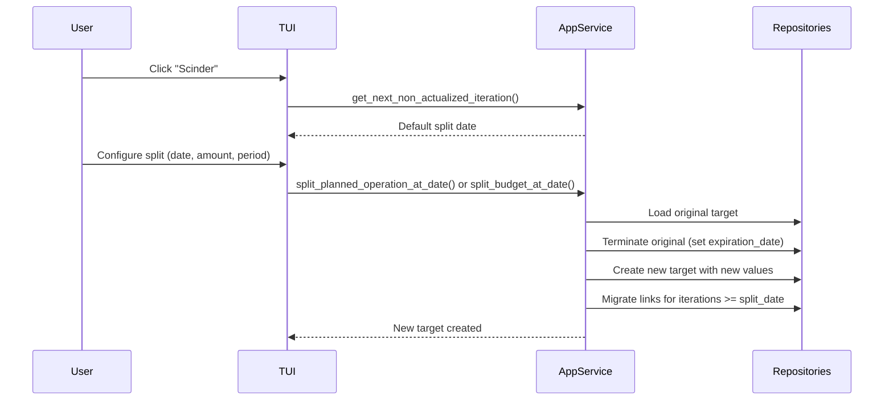
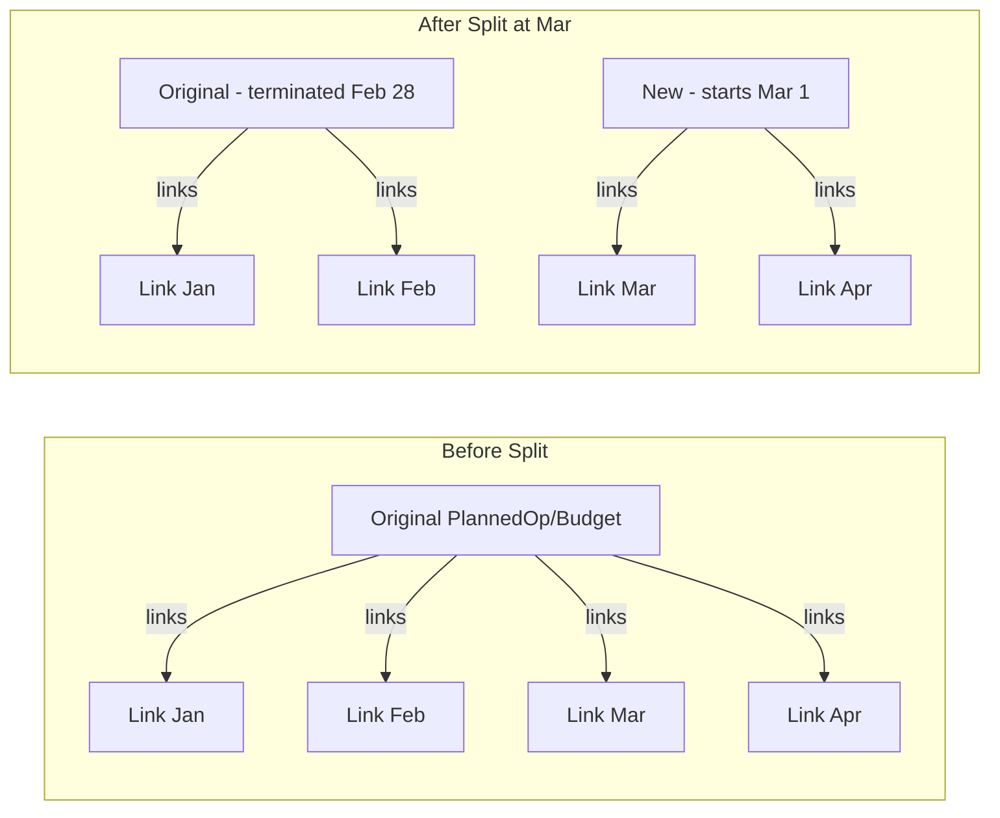

# Planned Operations & Budgets

This document describes the management of planned operations and budgets, including
modification operations like splitting.

## Overview

PlannedOperation and Budget extend ForecastOperationRange and represent expected future
activity. Both include an OperationMatcher for automatic linking to historic operations.

For the operation hierarchy and linking system basics, see
[Operations & Linking](operations.md).

## Splitting Operations and Budgets

Split functionality allows users to modify recurring planned operations or budgets from
a specific date while preserving historical data.

### Split Process

### Split Data Flow

### Key Behaviors

- **Termination**: Original element's `expiration_date` is set to `split_date - 1 day`
- **Creation**: New element inherits the original's description and category
- **Link Migration**: All links with `iteration_date >= split_date` are moved to the new
  target. The `target_id` is updated; `target_type` and `iteration_date` remain
  unchanged.
- **Manual links preserved**: Both manual and automatic links are migrated

### Validation Rules

- Split date must be strictly after the original's `start_date`
- Target must have a periodic date range (`RecurringDateRange` or `RecurringDay`)
- Non-periodic elements cannot be split

### ApplicationService Methods

- `get_next_non_actualized_iteration(target_type, target_id)`: Finds the first iteration
  without a linked operation (used as default split date)
- `split_planned_operation_at_date(operation_id, split_date, new_amount, new_period)`:
  Splits a PlannedOperation
- `split_budget_at_date(budget_id, split_date, new_amount, new_period, new_duration)`:
  Splits a Budget (includes duration parameter)
