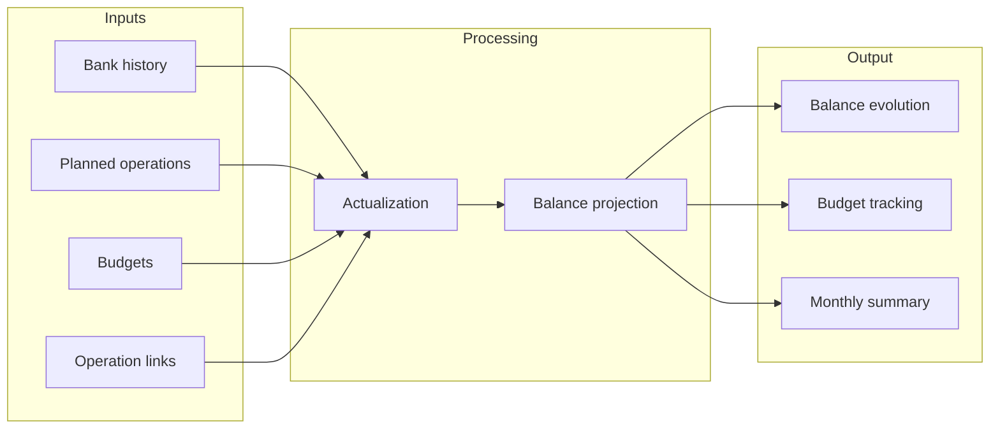
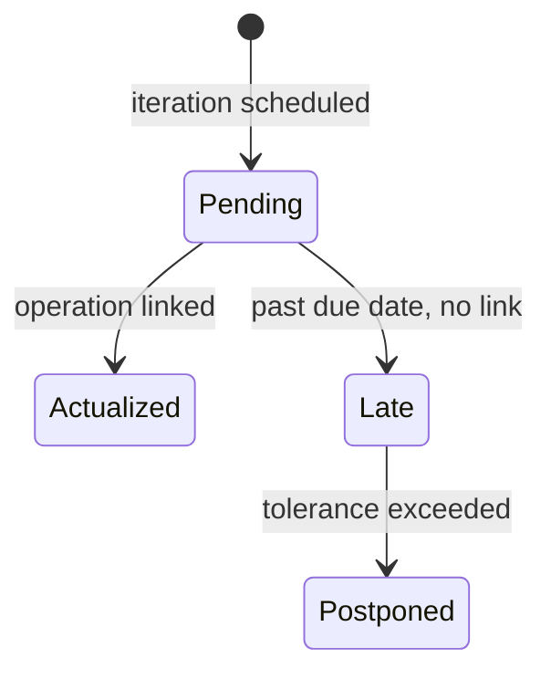

# Understanding the Forecast

The forecast is Budget Forecaster's core feature: it projects your future account
balance by combining your actual bank history with planned operations and budgets.

## How It Works



The forecast engine:

1. **Loads** all planned operations and budgets
2. **Actualizes** them using operation links (marks past iterations as done)
3. **Projects** the balance forward day by day, adding expected income and expenses

## Planned Operations

A planned operation represents a recurring or one-time expected transaction:

- **Salary** on the 28th of each month: +2500 EUR
- **Rent** on the 5th of each month: -800 EUR
- **Annual insurance** on March 1st: -600 EUR

Each planned operation generates **iterations** - specific occurrences on their
scheduled dates. For a monthly rent starting January, the iterations are Jan 5, Feb 5,
Mar 5, etc.

## Budgets

A budget represents a spending limit over a time period:

- **Groceries**: 400 EUR per month
- **Leisure**: 200 EUR per quarter

Unlike planned operations (single transactions), budgets represent aggregated spending.
The budget amount is distributed evenly across each day of the period.

## Operation Links

Links connect actual bank operations to their planned counterpart or budget. They tell
the system "this bank transaction corresponds to this planned iteration."

Links can be:

- **Automatic**: Created by heuristic matching (amount, date, category similarity)
- **Manual**: Created by the user in the TUI (protected from recalculation)

See [Operation Links](operation-links.md) for detailed usage.

## Iteration Statuses

Each planned operation iteration has a status that affects the forecast:



| Status         | Meaning                                  | Effect on forecast                 |
| -------------- | ---------------------------------------- | ---------------------------------- |
| **Pending**    | Future iteration, not yet matched        | Included in projection             |
| **Actualized** | Linked to an actual bank operation       | Excluded (replaced by real amount) |
| **Late**       | Past due date with no matching operation | Flagged, still included            |
| **Postponed**  | Late beyond tolerance threshold          | May be rescheduled                 |

### What "Actualized" Means

When an iteration is actualized, the forecast replaces the planned amount with the
actual transaction amount. For example:

- **Planned**: Electricity -95 EUR on Jan 15
- **Actual**: Bank shows -102 EUR on Jan 17
- **After linking**: The forecast uses -102 EUR instead of -95 EUR

### What "Late" Means

An iteration appears as LATE when its scheduled date has passed but no bank operation
has been linked to it. This typically means:

- The transaction hasn't arrived yet (delayed payment)
- The bank statement hasn't been imported yet
- The operation happened under a different description and wasn't matched

Late iterations remain in the forecast to keep the projection accurate.

## Balance Evolution

The forecast computes your balance for every day in the report period:

- **Past dates**: Uses actual bank operations (real transactions from your statements)
- **Future dates**: Uses planned operations and budgets (projected from the actualized
  forecast)
- **Balance date**: The pivot point - your last known actual balance

```
Past (actual)              Now              Future (projected)
──────────────────────────|──────────────────────────────
   Real bank operations   |   Planned operations + budgets
   Known amounts          |   Estimated amounts
```

The balance evolution curve shows how your account balance changes over time, combining
real history with the forecast projection.

## Budget Tracking

For each budget, the forecast tracks consumption:

- **Planned**: The full budget amount for the period
- **Actual** (Réel): Sum of real bank operations linked to this budget
- **Adjusted** (Ajusté): Projected spending for the current period based on links
- **Remaining**: Budget amount minus linked operations

### Daily Projection (Linear Decrease)

Budget spending is projected as a **linear decrease** over the period. For a monthly
budget of 400 EUR in a 30-day month, the forecast assumes 400 / 30 = ~13.33 EUR spent
per day.

When actual spending is known (via links), the remaining budget is spread over the
remaining days. For example, if 150 EUR has been spent by the 15th:

- Remaining budget: 400 - 150 = 250 EUR
- Remaining days: 15
- Daily projection: 250 / 15 = ~16.67 EUR per day

This gives a more realistic day-by-day balance curve than projecting the full amount on
a single date.

### Current Period Actualization

**Budgets** are considered **fully consumed** for the current period:

- Spent less than the budget -> actualized = budget (e.g., spent 300 of 400 EUR ->
  actualized = 400 EUR)
- Already exceeded the budget -> actualized = actual spending (e.g., spent 450 of 400
  EUR -> actualized = 450 EUR)

In short: **actualized = max(spent, budget)**.

**Planned operations** use the **actual amount as soon as it's known**:

- If a planned expense of 150 EUR is linked to an actual operation of 100 EUR, the
  forecast projects 100 EUR (not 150 EUR)
- If the iteration is not yet linked, the planned amount is used

### Example

Monthly groceries budget: 400 EUR

| Week | Linked operations                    | Remaining |
| ---- | ------------------------------------ | --------- |
| 1    | Supermarket -80 EUR                  | 320 EUR   |
| 2    | Market -45 EUR                       | 275 EUR   |
| 3    | Supermarket -95 EUR                  | 180 EUR   |
| 4    | _(forecast shows 180 EUR remaining)_ |           |

If linked operations exceed the budget, the remaining amount goes negative (overspent).

## Monthly Summary

The forecast report includes a monthly summary with three columns per month:

| Column                | Meaning                                                       |
| --------------------- | ------------------------------------------------------------- |
| **Réel** (Actual)     | Sum of real bank operations for that month                    |
| **Prévu** (Planned)   | Sum of planned operations and budgets for that month          |
| **Ajusté** (Adjusted) | Projected amounts for the current month, accounting for links |

- Past months only show **Réel** and **Prévu**
- The current month shows all three columns
- Future months only show **Prévu**

## Excel Export

The forecast report can be exported to Excel from the Forecast tab. The export includes:

- Balance evolution chart
- Monthly summary by category (Réel / Prévu / Ajusté)
- Budget statistics (total and monthly average per category)

## Tips

- **Import bank statements regularly** to keep the forecast accurate
- **Link operations manually** when automatic matching fails (press `L` in the
  Operations tab)
- **Use budgets** for variable spending categories (groceries, entertainment) and
  **planned operations** for fixed amounts (rent, salary)
- **Split operations** when amounts change (e.g., salary increase) to preserve history
  while updating the forecast
